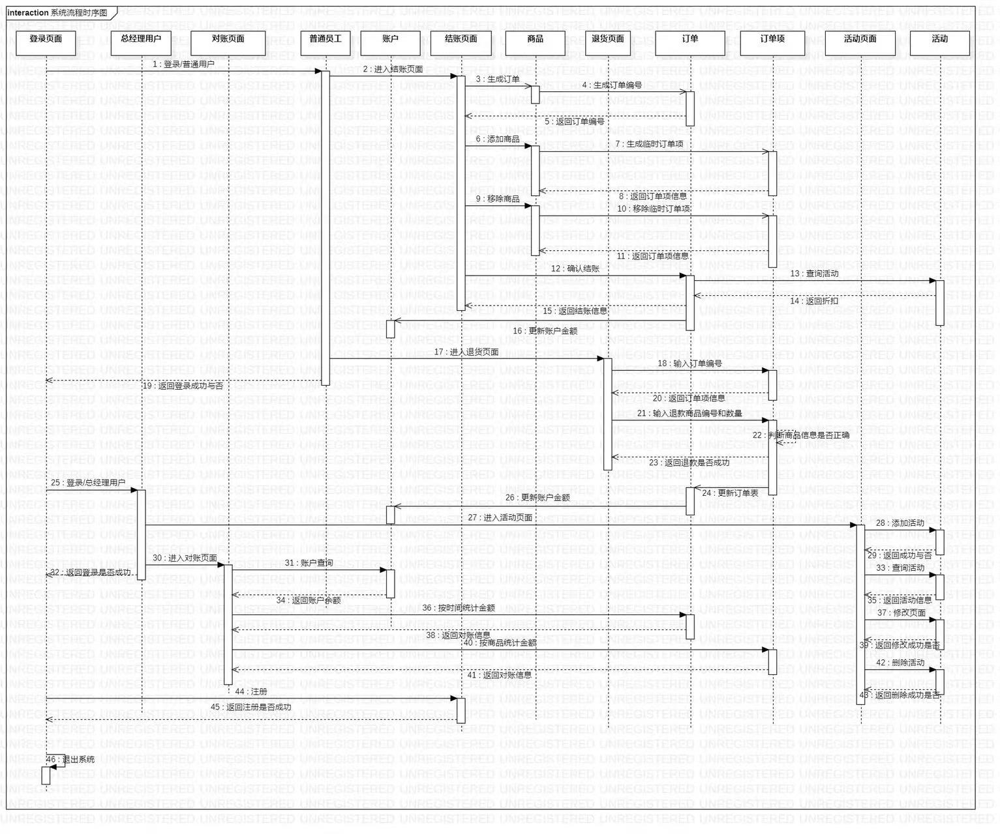
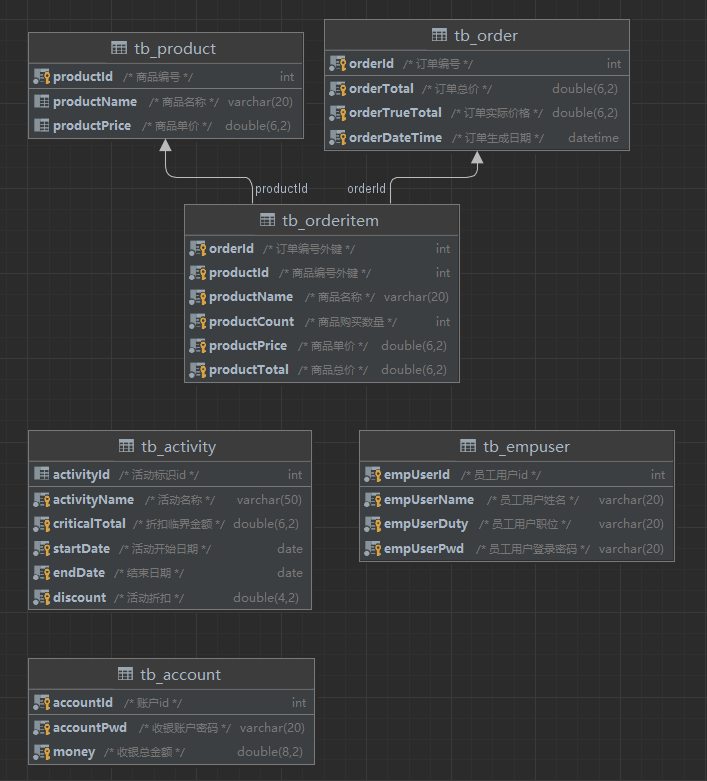
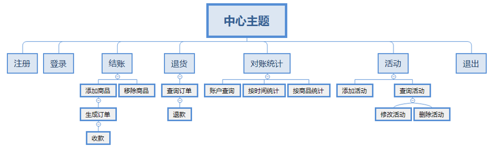

## 吉软第一阶段项目介绍
第一阶段的控制台项目。项目名称为 【超市收银系统】

[源码](src/main/java/com/myhd/)

[pom.xml](pom.xml)

[答辩PPT](src/main/resources/答辩.pptx)

[需求分析文档](src/main/resources/超市收银系统需求文档.docx)

时序图：

数据库表关系图：

要求实现的功能：
1. 登录
1. 注册
1. 结账(添加商品，删除商品，生成订单)
1. 退货(查询订单，退款)
1. 对账(账户查询，按时间查询，按商品查询)
1. 活动(添加活动，修改活动，删除活动)

### 附件
[mysql数据库文件](SQL文件/jsoft_project01.sql)