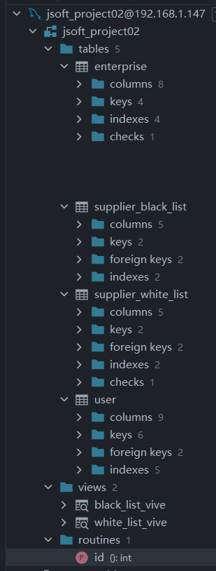
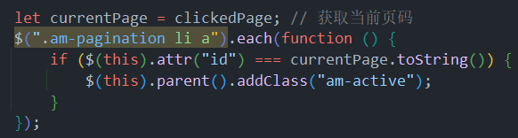

# 个人开发记录

## 项目介绍

[原项目地址: 点击查看](https://github.com/Jinhui-Huang/jsoft-project02/tree/master)

前端技术栈：`Ajax`, `JS`, `CSS`

后端技术栈: `Mybatis`, `Druid-JDBC`, `junit`, `jwt(令牌验证)`, `logback+sl4j+lombok(日志记录框架)`, `servlet+jsp+connector(服务器-数据库连接接口)`, `maven(项目管理框架)`

数据库: `MySQL`

## 材料

<details>
<summary>UML图</summary>

时序图：


ER图：


企业信息认证用例图：


供应商白名单管理用例图：


供应商黑名单管理用例图：


实体类图：


数据库建模：



</details>


<details>
<summary> 开发流程 </summary>

## 9-22第一天 

下午：绘制项目实体类类图，数据库ER图，项目业务用例图。

晚上：办公室开会，绘制项目时序图。

## 9-23第二天

上午：完成`EnterpriseDao`接口实现 和 `SupplierWhiteListDao`接口实现 （mybatis）

下午：完成`SupplierWhiteListDao`三表联查SQL语句 和 `SupplierWhiteListDao`的模糊查询

## 9-24第三天

上午: 完成`EnterpriseServiceImpl` 和 `SupplierWhiteListServiceImpl`

下午: 服务层的异常处理（处理可能出现的异常）和`Servlet`的编写

晚上：完成了`EnterpriseServlet`和`SupplierWhiteListServlet`, 简单编写了信息认证界面ajax代码

## 9-25第四天

上午：回学校开会

下午：完成了`info-certification`页面的put请求，完成白名单界面的模糊查询功能

## 9-26第五天
上午： 完成白名单添加供应商功能

下午： 完成白名单数据移至黑名单功能，分页跳转功能

两个bug：

1. 分页跳转：点击页码可以正常跳转。点击上一页和下一页会重复提交数据， 跳转陷入循环(已解决)

2. 下拉列表中的企业信息不能与数据库同步更新 (已解决：将mybatis连接对象改为**单例模式**)

晚上：协助完成黑名单相关功能，项目基本完成

## 9-27第五天

上午：修复了一个页面bug ( 添加完供应商数据残留问题：添加完成后清空数据 )；在右上角添加企业ID，增强用户体验。项目完成


</details>

<details>
<summary> 心得 </summary>

## 心得

开发过程中对很多细节有一些巧妙的处理，使用的方法可能是我之前没有掌握或者没见过的，这里记录一下

1. 白名单下方的页码按钮

首先，根据后端返回的pageInfo获取分页信息，然后使用JQuery动态生成页码按钮，这就不多说了。关于页码的点击高亮展示，首先会清除所有按钮的高亮状态，然后根据点击的按钮id (按钮的id就是页码的数字)，为其添加高亮的样式(amazeUI的CSS样式: `am-active`)



`.each( function(){} )` : 用于迭代匹配的元素集合，并对每个元素执行一个函数。

`$().attr()` 和 `$().prop()` 都是用于获取JQuery对象的属性值。不同点在于，`$().attr()`通常用于处理DOM属性，而`$().prop()`通常用于处理HTML自身的属性,如 href, id, name等

2. 一个需要注意的点，关于ajax

ajax使用的方式

```js
$.ajax({
    url: "http://localhost:8080/test",
    type: "post" ,        //设置数据传输方式为`post`
    dataType: "json" ,    // 设置数据传输格式为JSON, 如果是get请求, 传输格式不是JSON就不写
    async: true ,     //设置异步传输,默认值为true(开启异步)
    data: JSON.stringify({    //如果传输JSON格式数据, 记得加上`JSON.stringigy()`
        name: "zhangsan",
        age: "20"
    }),
    success: function (result) {
        //对返回值进行处理
    },
    error: function (result) {
        //对返回值进行处理
    }
})
```

</details>

