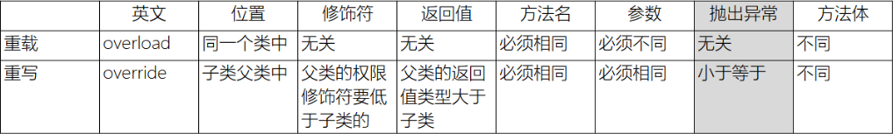

### 面向过程和面向对象的区别
面向过程关注的是解决问题的每一个步骤，而面向对象关注的是谁有能力来解决该问题。 ^304001
- 面向过程到面向对象的变化其实就是一个由**执行者**到**指挥者**的过程。
### 面向对象的三个阶段
OOA - Object Oriented Analysis
		1. 从当前系统中找出所有参与的对象
		2. 分析这些对象共有的静态特征和动态特征
OOD - Object Oriented Design
		1. 将所有参与的对象提取成一类，确定类名
		2. 确定保留哪些静态特征和动态特征，为静态特征和动态特征命名
OOP - Object Oriented Programming ^42d709
#### 类和对象  <- OOP所关注的 
类：具有***相同属性***和***共同行为***的***一组对象***的集合
对象：类的实例化

---

#### 面向对象自定义类两个问题
1. 自定义类属性为什么是在方法外声明的变量（成员变量）？
	对象的相同的属性，要放在方法外声明。根本原因是为了扩大作用域。之前的变量都是局部变量，局部变量的作用域只在方法内，离开方法无法使用。而现在的属性需要在本类下任何地方甚至是其他类里也能使用。
2. 自定义类方法为什么不是static修饰的？
	- static修饰的方法叫*静态方法*，静态方法不需要实例对象就可以直接调用执行。
	- static修饰的方法，在类加载时会被加载到内存中，并在Method Area中开辟一块内存空间。
	- static是不允许用来修饰局部变量

---
#### 成员变量和局部变量
1. 声明方式
	成员变量：声明在方法之外，类中
	局部变量：声明在方法之中，或代码块中
2. 变量作用域
	成员变量作用域是本类或其他类
	局部变量作用域是当前代码块或当前方法
3. 有无默认值
	成员变量有默认值
	局部变量无默认值
4. 是否需要初始化
	成员变量不需要被初始化
	局部变量必须初始化
5. 内存中位置
	成员变量在堆内存
	局部变量在栈内存
6. 生命周期
	成员变量：当前对象从创建到销毁
	局部变量：当前方法从执行开始到执行完毕
7. 同名问题
	成员变量和局部变量可以同名，同名时*局部变量*优先级**更高**

---
#### 构造方法

^21299e

1. **什么是构造方法？**
	- 方法名和类名完全相同
	- 构造方法无返回值
>如果没有手动创建一个构造方法，Java会自动帮我们创建一个无参构造方法。如果我们自己创建了一个 无参/有参构造方法，Java就不会帮我们创建 有参/无参构造方法。
```
public class Class {  
	private int classNo;  
	private String className;  
	//无参构造方法
	public Class() {  
	}
	//有参构造方法
	public Class(int classNo, String className) {  
		this.classNo = classNo;  
		this.className = className;  
	}  
}
```
2. **构造方法的作用**
	- 实例化
		创建对象。没有构造方法，无法创建实例 (对象) 。
	- 初始化
		给对象的属性赋初始值。

---
#### this关键字

^ad9026

- this代表当前对象
- this关键字的用法
	this.成员变量     用于区分同名的成员变量和局部变量
	this.方法()          用于本类下方法之间互相调用
	this()                  用于本类下构造方法之间的互相调用(调用语句要在构造方法第一行)

---
#### static关键字
1. static代表类所拥有的
	static可以修饰变量，方法，内部类，代码块
	作用：
		- 访问方便    `类名.资源`   `Arrays.sort( );`
		- 内存中提前加载
		- 静态资源在对象之间数据共享
2. static关键字用法
	静态方法 (又叫 类方法) 不可以使用`this`关键字
	静态方法可以 `类名.静态方法()` 也可以 `对象名.静态方法()` 但是不建议使用第二种
>JVM内存是先加载静态变量，还是静态方法？
>类加载 -> 静态变量 -> 静态方法 -> 构造方法


---
#### 代码块

^193bff

1. **类的组成**
	属性，方法，构造器，代码块，内部类（多继承）
2. 代码块的分类
	普通代码块 - 在方法里的代码块
	构造代码块 - 对象创建后的初始化工作
	静态代码块 - 跟静态变量很像，静态代码块中的内容在类加载时执行, 且只执行一次。
	同步代码块（多线程）
3. 为什么需要代码块？
	起初目的是为了*划分作用域* 。
	内存中加载顺序： 
		类加载>静态变量>静态代码块>静态方法>非静态变量>非静态方法>构造代码块>构造方法

---
#### 包
包的作用：
	1. 解决重名问题 (包对应的就是盘符上的目录)
	2. 解决权限问题
		缺省权限修饰符，**权限范围**就是*同包*下
包的命名规范
	1. 名全小写
	2. 中间用.隔开
	3. 公司域名倒着写 : `com.jd   com.tencent`
	4. 加模块名/项目名 : `com.jd.login`
	5. 不可使用系统关键字
导包
	`import **.*.*`   -> `import java.util.Date;`
	静态导入：
		`import static java.lang.Math.*` 导入`java.lang`下的`Math`类中所有的静态内容。在静态导入后，同一个类中有相同方法时，**优先走自己定义的方法**。
**java中的包都是同级关系**
```
	import java.util.Math; 
	import java.util.*;   //√    

	import com.javase.homework.bank.info.Bank;
	import com.javase.homework.bank.test.Main;
	import com.javase.homework.bank.*;    //×
	/*
	 *java中包是同级关系，没有子包和父包概念。因此无法导入一个包下的其他包。这种写法      *是错误的
	 */
	
```
---
#### 权限/访问修饰符

^a838a5

1. `public`  
	修饰类，方法，属性
	类内√ 同包√ 子类√ 不同包子类√  其他包√
2. `protected`
	修饰内部类，接口，属性，方法
	类内√ 同包√ 子类√ 不同包子类√/× 其他包×      [关于protected不同包子类的注释](https://www.runoob.com/java/java-modifier-types.html#protected-desc)
3. `default 缺省`
	修饰类，属性，方法
	类内√ 同包√ 子类× 不同包子类×其他包×
4. `private`
	修饰内部类，属性，方法
	类内√ 同包× 子类× 不同包子类×  其他包×

---
## 封装

^44ac3f

面向对象编程三大特征：封装，继承，多态
- 安全问题
	在不考虑封装时，类中的成员变量权限不为`private`，此时其他类可以直接操作该成员变量。这种直接操作类中属性的行为会导致一些安全问题，因此我们将成员变量访问权限设置为`private`，并让外部类通过`public`的`getter()` 和 `setter()`方法来操作成员变量。这种操作就是对属性进行*封装*。


---

## 继承

^8dccc9

1. 继承的引入
	随着项目发展，功能越来越多，流程越来越复杂，类越来越多。不同类中有大量相同的属性和方法。为了减少相同代码的编写，使用继承可以实现代码复用。
2. 使用继承
	1. 将多个类中的相同属性和共同行为提取出来，放到一个单独类中, 这个类叫父类/基类/超类
	2. 将各自特有的代码留在原类下，这些类叫子类/派生类
	3. 子类使用`extends`继承父类
3. 继承的好处
	- 提高代码复用性
	- 便于代码拓展
4. 子类能用什么
	父类的资源，子类都可以继承过来，包括`private`修饰的字段。但是使用父类资源要看父类中资源的权限。   ***父类的构造方法，子类不可以继承，但是可以调用***
5. 继承关系下构造方法的执行顺序
	- 子类构造方法中，如果我们没有**手动调用**父类的构造方法，程序会自动帮我们调用父类的无参构造方法
	- 但是如果我们**手动调用**父类构造方法，程序不会再自动帮我们调用父类的其他构造方法
	- 由于一个子类的父类可能有其他父类，所以程序会找到**终极父类** `Object`类，先执行父类的构造，再回来执行子类的构造。当所有的父类构造都执行完毕，再执行子类构造。
6. 继承的特点
	- 传递性 ：子类可以使用父类的资源，也可使用父类的父类的...资源
	- 单根性 ： 一个类只能有一个父类
>1. 一个类必须要有一个无参构造
>2. 一个子类有两种继承方式：显式继承`extends`和隐式继承 (`extends Object`)


---
#### super关键字

^18cee2

`super`代表父类
`super`可以修饰属性，方法，构造器
子类调用父类构造器： `super();`    `super(Param param);`
`super`可以调用父类的父类的方法
>需要注意的是：子类调用父类构造器时，必须写在第一行。


---
#### 方法的重写(Override) 
注意与[[4-方法#^b6824e|方法的重载(Overload)]]区分
-  重写发生在哪里？
	继承关系的子类里。子类重写父类的方法。
- 重写与重载的区别!

---

### Object类
`getClass()`:  获取当前类的Class对象
`hashCode()`:  哈希码，对应当前对象在内存中的地址
`equals()`: 比较两个对象内存地址是否相同
`toString()`: 将当前对象转为字符串格式
#### `toString()`
```
public String toString() {  
    return getClass().getName() + "@" + Integer.toHexString(hashCode());  
}

//getClass().getName():获取类的全局限定名(包名+类名 com.javase.Bubble)
//Integer.toHexString(hashCode()):将地址哈希码转为16进制的整型数,以字符串形式输出
```
几乎所有的实体类都需要重写`toString()`方法。

---
## 多态

^3b8a8e

	定义：不同的子类，在做同一行为的时候，有不同的表现形态。
#### 1. 多态的前提条件
1. 有继承/实现关系
2. 有方法重写
3. 有父类引用指向子类对象
#### 2. 多态的作用
提高了代码的拓展性，可维护性。

多态的弊端： 不可以调用子类的特有方法。
#### 3. 多态只关注行为
多态的特性：动态绑定
```
Animal类
public class Animal {  
    public void eat(){  
        System.out.println("吃东西...");  
    }  
}
```
```
Cat类
public class Cat extends Animal{  
    @Override  
    public void eat() {  
        System.out.println("猫猫吃🐟...");  
    }  
}
```
```
Dog类
public class Dog extends Animal{  
    @Override  
    public void eat() {  
        System.out.println("狗狗吃💩。。。");  
    }  
}
```
```
Feeder类
public class Feeder {  
    public void feed(Animal animal){  
        animal.eat();  
    }  
}
```
```
测试
public static void main(String[] args) {  
    Cat cat = new Cat();   
    Dog dog = new Dog();  
    Feeder feeder = new Feeder();  
    feeder.feed(cat);  
    feeder.feed(dog);  
}
```
`java`会在程序运行时**动态**调整传入参数的类型。在使用对象调用方法时，会调用传入的对象的方法\[`cat.eat()`]，而不是编写代码时的对象的方法\[`animal.eat()`]。

#### 4. 多态的两种表现形式
1. 父类做参数
2. 父类做返回值类型  ==> 工厂设计模式  ^4420d7

#### 5. 引用数据类型之间的类型转换
***向上转型:***  自动发生     `Animal animal = new Dog();`

对象只能调用父类有的方法或子类重写的方法。子类里特有的方法无法调用

`animal.eat();` √      `animal.bark();` ×

***向下转型:***  手动强制转换   `Dog dog = (Dog) new Animal();`
	
对象可以调用本身的方法，也可以调用父类的方法
	
`dog.eat();` √         `dog.bark();` √
     
```
	Animal animal = new Dog();
	Cat cat = (Cat) animal;    
	//Exception in thread "main" java.lang.ClassCastException 类型转换异常
----------------------------------------
	Animal animal = new Dog();
	if(animal instanceof Cat){       //如果animal是Cat类型
		Cat cat = (Cat) animal;     //就将animal强转为Cat类型
	}else{                         //否则
		Dog dog = (Dog) animal;   //将animal强转为Dog类型
	}	
```

#### 多态的成员访问特点：
成员变量：编译时检查父类是否存在该成员变量，不存在就报错    运行时使用父类的成员变量

方法：编译时检查父类中是否存在该方法，不存在就报错    运行时使用子类重写后的方法
```
public static void main(String[] args){
	Fu f = new Fu();
	System.out.println(f.num);  //打印 10 ;  编译期间检查父类中的num
	f.show();  // 输出 zi... show ; 编译期间检查父类的方法
}
class Fu{
	int num=10;
	public void show(){
		System.out.println("fu...  show");
	}
}
class Zi extends Fu{
	int num=20;
	@Override
	public void show(){
		System.out.println("zi...  show");
	}
}
```

---
## abstract关键字

^05bcbd
`abstract`修饰类和方法
#### 1. 抽象类
	程序中不需要该类创建对象，就把该类(一般是父类)设为抽象类
`public abstract class 类名{}`
>抽象类是不允许创建对象的。因为一旦允许抽象类创建对象，就可以通过对象调用抽象类中没有方法体的抽象方法。这样做其实是没什么意义的。因此规定抽象类不可以创建对象

>抽象类虽然不能创建对象，但是是有构造方法的。因为子类的构造方法需要调用父类的构造方法。因此抽象类的构造方法就是为了给子类访问的。

#### 2. 抽象方法（只能存活在抽象类中）
	父类要求子类必须重写某一方法的时候，可以将该方法写为抽象方法。
	如果子类不想重写抽象方法，那么子类必须成为抽象类。（不建议）
将共性的行为抽取到父类后，发现该方法的**实现逻辑**无法在父类中给出具体明确（描述不清了），该方法就可以定义为抽象方法
`public abstract 返回值类型 方法名(参数列表);`

**一个类中如果有抽象方法，那么该类一定是抽象类。但是一个抽象类，可以没有抽象方法。**

---
## final关键字

^55dee6

`final` : 将一个变量或方法设为常量
>1. 规范来说，常量名由大写字母组成
>2. 常量应该在声明的同时赋值
>3. `final`修饰基本数据类型，值不可以改。`final`修饰引用类型变量，地址值不可改

`final`修饰的变量表示**最终**变量，不可以被修改

`final`修饰的方法表示**最终**方法，不可以被重写

`final`修饰的类表示**最终**类，不可以被继承

---
## native关键字
`native`修饰的方法叫`本地方法`,`本地方法`和系统以及平台有关。
`native`方法和平台关联性很高，因此其移植性很低
`native`方法一般是操作文件，访问系统底层。这件事Java并不擅长，但是C语言很擅长。

---
## 接口

^741623

	接口的出现和内部类一样，为了解决java的单根性问题。
>Java中的类只能单继承，但是却可以多实现 (`implements`)
>"父类决定了你是什么，接口决定了你会什么" - 佚名 

子类    is    父类 
子类   has  接口
##### Q&A : 有一个行为/方法，是写在父类中还是接口中？
如果该方法是所有子类都共有的，就写在父类中。如果不是就写在接口中。
##### Q&A : 接口和抽象父类有什么区别？
1. 相同点
	- 子类可以继承抽象父类，子类可以实现接口
	- 接口和抽象父类都不可以创建对象
	- 抽象父类和接口里都可以由抽象方法和非抽象方法
	- 抽象父类和接口都会要求子类/实现类必须将抽象方法全部实现，否则子类/实现类就会变成抽象类
2. 不同点
	- 子类只能继承一个父类，子类可以实现很多个接口
	- 抽象父类有构造方法，但是由于是抽象类，不能创建对象。接口由于没有构造方法，所以也不能创建对象。要注意，这两个不能创建对象的原因不一样。
	- 抽象类中可以有变量，也可以有常量。而接口中只能有常量(`public static final`)
	- 类的关键字是`class`, 接口的关键字是`interface`
##### 接口格式声明
```
[访问修饰符] interface 接口名 [extends 接口1, 接口2, ...]{
	常量定义;
	方法定义;
}
------------------------------------------
JDK1.8之后，接口中可以定义普通方法，在此之前接口中只能定义抽象方法：
void pp();  ==  public abstract void pp(); //该方法必须被子类实现
public default void show(){ }; //该方法在接口是被定义为一个普通方法。实现类既可以实现也可以选择不实现
```
---
## 内部类
