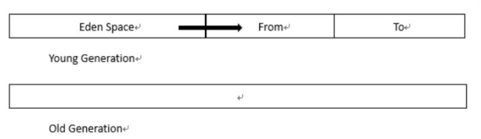
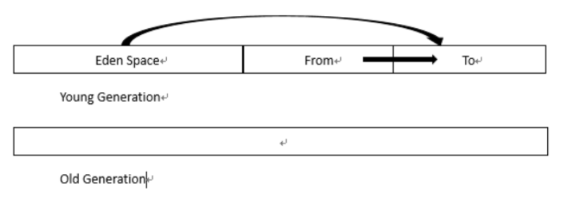
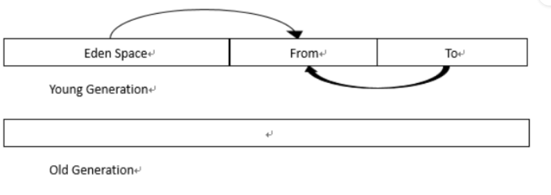
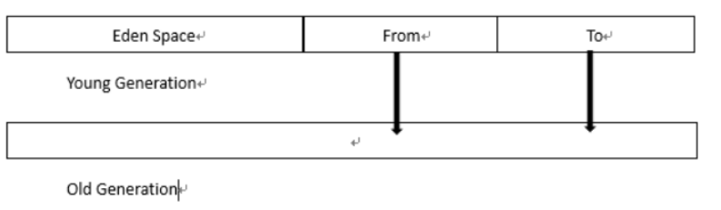

[JVM底层原理看这一篇就够了，带你彻底搞懂JVM底层原理 - 知乎 (zhihu.com)](https://zhuanlan.zhihu.com/p/609717252)


### 程序计数器（寄存器）Program Counter Register
作用：
	记住下一条指令 (二进制字节码文件) 的执行地址
特点:
	**线程是私有的** 每个线程都有自己的程序计数器
	**不会存在内存溢出**
### 栈 Java Virtual Machine Stacks
- 数据结构特点：先进后出 FILO
- *栈是线程运行需要的内存空间*
- **栈帧**：每个方法运行时需要的内存 （保存参数，局部变量，返回地址等数据）
- *调用方法，栈帧入栈。执行完毕后出栈释放内存。*
- 每个栈由多个栈帧(Frame)组成，对应着每次方法调用时所占用的内存
- 每个线程只能有一个活动栈帧，对应着当前正在执行的那个方法（栈顶部正在执行的栈帧）
Q&A:
	*1. GC垃圾回收是否涉及栈内存？*
		不涉及。因为栈内存是方法调用所产生的，而方法调用完毕后栈帧会自动弹出栈，内存自动释放。 *垃圾回收只是去回收堆内存中的无用对象*
	*2. 栈内存越大越好吗？*
		栈内存可用 `-Xss size` 指定。不指定的话默认情况下 linux/macos/oracle solaris 栈内存大小为1024KB 。windwos会根据虚拟内存来为栈分配内存大小。
		栈内存并不是越大越好。栈内存大了能够进行更多次的方法递归调用，而不会增加效率。反而会导致线程数目变小。
	*3. 方法内的局部变量是否线程安全？*
		是安全的。多个线程同时执行一个方法，该方法会在多个线程中产生栈帧，而局部变量又是方法内私有的，因此多个线程中的栈帧都会产生自己的局部变量。同时执行并不会导致变量值的混乱。因此是安全的。
线程安全
	如果方法内局部变量没有逃离方法的作用范围，那么就是线程安全的。
	反之，如果该局部变量作为参数传给方法，或者作为返回值返回方法，那么别的线程就有可能可以访问该变量，此时有风险，线程不是安全的。需要我们考虑线程安全问题。
**栈内存溢出**
	1. 栈帧过多导致栈内存溢出
		- 方法递归调用 没有设置正确的结束条件
	2. 栈帧过大导致栈内存溢出

本地方法栈
	调用本地方法时使用的内存。
	**本地方法:** 简单地讲，一个Native Method就是一个java调用非java代码的接口。一个Native Method是这样一个java的方法：该方法的实现由非java语言实现，比如C。

### 堆 Heap
- 通过new关键字创建的对象都会使用堆
- 是线程共享的，因此堆中的对象需要考虑线程安全问题
- 有GC垃圾回收机制
**堆内存溢出**
	`-Xmx size `可以指定JVM堆空间大小。

### 方法区 Method Area

- 方法区是线程共享的
- 方法区存储类的数据
**运行时常量池(Runtime Constant Pool)**
- 常量池就是一张表，虚拟机指令根据这张常量表找到要执行的类名，方法名，参数类型，字面量等信息
- 运行时常量池，常量池是`*.class `文件中的，当该类被加载，它的常量池信息就会放入运行时常量池，并把里面的符号地址变为真实地址
**StringTable(串池 - 运行时常量池的一个组成部分)**
- 常量池中的字符串仅是符号，第一次用到才变为对象
- 利用串池的机制，来避免重复创建字符串对象
- 字符串变量拼接的原理是`StringBuilder`
- 字符串常量拼接的原理是编译期优化
- 可使用intern方法，主动将串池中还没有的字符串对象放入串池
	- `1.8`将这个字符串对象尝试放入串池，如果有则不会放入。如果没有则放入串池，会把串池中的对象返回
	- `1.6`将这个字符串对象尝试放入串池，如果有则不会放入，如果没有会把此对象*复制一份*，放入到串池，并把串池中的对象返回。

### JVM的类加载机制
Java虚拟机（JVM）的类加载机制是Java语言的核心特性之一，它负责将编写的Java源代码转换为可执行的字节码并加载到内存中。类加载机制是Java平台的关键组成部分，负责管理类的加载、链接和初始化。
1. **加载（Loading）**： 类加载的第一阶段是加载。在这个阶段，类加载器负责查找并加载类的字节码。字节码可以来自本地文件、网络、其他JAR文件等。加载完成后，字节码被存储在方法区（Method Area）中。

2. **验证（Verification）**： 加载后，类文件需要进行验证以确保其完整性和合法性。验证阶段包括字节码验证、符号引用验证、类型检查等步骤。目的是为了防止恶意代码或非法类的执行。

3. **准备（Preparation）**： 在准备阶段，JVM 为类的静态成员变量分配内存并设置默认初始值（例如，0或null）。这里只分配内存，不包括初始化变量的赋值。

4. **解析（Resolution）**： 解析阶段是将符号引用转换为直接引用的过程。符号引用是一种以字符串形式表示的类、字段、方法等，而直接引用是指向具体内存地址的引用。解析是JVM处理虚方法、字段引用等的过程。

5. **初始化（Initialization）**： 初始化阶段是类加载的最后一个阶段。在这个阶段，类的静态变量被赋予程序员指定的初始值，以及执行类构造器 `<clinit>` 方法。类构造器是一个特殊的静态方法，用于执行类的静态初始化代码块。

6. **使用（Usage）**： 一旦类加载完成并初始化，它就可以被程序中的其他部分使用。在这个阶段，程序可以创建类的实例、调用类的方法、访问类的字段等。

>需要注意的是，类加载是按需进行的，即只有在首次使用类时才会进行加载。这种懒加载的方式有助于节省系统资源。
>另外，JVM支持多个类加载器，每个加载器都有其自己的加载范围和优先级。例如，`Bootstrap ClassLoader`负责加载核心Java类，`Extension ClassLoader`负责加载扩展类，而`Application ClassLoader`负责加载应用程序的类。

1. **Bootstrap ClassLoader**：
    
    - 也称为引导类加载器，是JVM内置的最顶层的类加载器。
    - 主要负责加载Java核心类库，包括`java.lang`包中的类，这些类构成了Java语言的基础部分。
    - 由于它是用C/C++实现的，并且位于JVM的内部，因此在Java代码中无法直接引用Bootstrap ClassLoader。
    - Bootstrap ClassLoader没有父加载器，它是类加载器层次结构的根。
    - 加载路径: `%JAVA_HOME%/lib` 路径下的jar包
1. **Extension ClassLoader**：
    
    - 也称为扩展类加载器，是位于Bootstrap ClassLoader下面的一层加载器。
    - 主要负责加载JRE扩展目录（通常是`$JAVA_HOME/lib/ext`目录下的JAR文件）中的类。
    - 在标准JVM中，Extension ClassLoader的父加载器是Bootstrap ClassLoader。
    - Extension ClassLoader的主要作用是加载一些Java标准扩展库，如JDBC驱动、JMX代理等。
    - 加载路径: `%JAVA_HOME%/jre/lib/ext` 路径下的jar包
1. **Application ClassLoader**：
    
    - 也称为应用程序类加载器，是Java应用程序默认的类加载器。
    - 主要负责加载应用程序类路径（Classpath）上指定的类。Classpath是一组目录和JAR文件，包含了应用程序代码的位置。
    - Application ClassLoader的父加载器是Extension ClassLoader，它可以加载应用程序代码以及应用程序依赖的库。
    - 加载路径: `CLASSPATH`路径下指定。如未设置则为应用程序当前路径

这三个类加载器构成了一个层次结构，通过**父类加载器委托机制**来加载类。当一个类需要被加载时，首先由`Application ClassLoader`尝试加载，如果找不到类，它会委托给`Extension ClassLoader`，再接着委托给`Bootstrap ClassLoader`。这种层次结构确保了类的加载顺序和隔离性。

### 双亲委派机制 ( Parent Delegation Model )
双亲委派机制（Parent Delegation Model）是Java类加载器的一种工作机制，用于保证类的加载的一致性和安全性。它是Java类加载机制的核心原理之一，确保在JVM中不同的类加载器之间存在一种父子关系，父加载器可以委派给子加载器加载类，而不是每个加载器都去尝试加载类。

双亲委派机制的主要特点和工作原理:

1. **层次结构**： Java类加载器形成了一个层次结构，其中最顶层是Bootstrap ClassLoader，其下是Extension ClassLoader，再下面是Application ClassLoader。每个类加载器都有一个父加载器，除了Bootstrap ClassLoader外，其他加载器的父加载器都是上一级加载器。

2. **委派**： 当一个类加载器收到加载类的请求时，它首先不会尝试自己加载，而是将加载请求委派给其父加载器 **(向上委派)**。父加载器会继续将请求向上委派，直到达到Bootstrap ClassLoader。如果Bootstrap ClassLoader无法加载类 ( 通常是因为该类的class文件在父类的加载路径中不存在 )，就会回溯到子加载器 **(向下委派)**，子加载器会尝试加载类。这个过程一直持续，直到类被加载成功或者整个加载层次结构都无法加载这个类，会抛出`ClassNotFoundException`异常。

3. **安全性**： 双亲委派机制确保了类的加载的安全性。因为类加载器只有在其父加载器无法加载类时才会尝试加载，这样可以防止不同类加载器加载同名的类，从而保障了类的命名空间隔离和避免了类的冲突。

4. **性能**： 双亲委派机制可以提高类加载的性能。一旦一个类被加载，它会被缓存，以便后续加载请求能够快速返回已加载的类。这减少了类的重复加载，提高了加载效率。

总结：
向上委派保证先加载JDK的核心类，再加载应用程序的类，有效防止了因为应用程序中因为某个类存在一些不安全问题，导致JVM变得不安全。 向上委派机制保证了JVM的安全性
向下委派机制保证需要加载的类都得到了加载。
```java
//举个例子 说明为什么向上委派机制保证了JVM的安全性
public class StringBuffer {
      public StringBuffer(){
      }
}
```

👆 我自定义了一个`StringBuffer`类，这个类和JAVA核心类库中的`StringBuffer`类重名。如果没有向上委派机制，该自定义类优先加载，就会导致`StringBuffer`类变成了我自定义的类，这样会导致一些安全问题。

### TomCat如何打破双亲委派机制？
[tomcat如何破坏双亲委派机制](https://www.zhihu.com/question/466696410)

### GC机制
GC机制是JVM的垃圾回收机制，它会自动地帮我们回收不再被引用的对象，释放内存空间，这个过程是自动的，减轻了程序员的负担。
**理解GC机制就从：“GC的区域在哪里”，“GC的对象是什么”，“GC的时机是什么”，“GC做了哪些事”几方面来分析。**
#### 1.GC的区域
jvm 中，程序计数器、虚拟机栈、本地方法栈都是随线程而生随线程而灭，栈帧随着方法的进入和退出做入栈和出栈操作，实现了自动的内存清理，因此，我们的内存垃圾回收主要集中于 java 堆和方法区中，在程序运行期间，这部分内存的分配和使用都是动态的。
#### 2.GC的对象
GC的对象就是不再存活的对象。判断对象是否存活有两种办法：引用计数，可达性分析
##### 引用计数
每个对象都有一个引用计数属性，新增一个引用时+1，释放一个引用时-1。计数器归零时即可回收。该方法比较简单，但是无法解决循环引用的问题。
##### 可达性分析
从GC Roots开始向下搜索，搜索所走过的路径称为引用链。当一个对象到GC Roots没有任何引用链相连时，则证明此对象是不可用的。不可达对象。
>在Java语言中，GC Roots包括：
>虚拟机栈中引用的对象。
>方法区中类静态属性实体引用的对象。
>方法区中常量引用的对象。
>本地方法栈中JNI引用的对象。

#### GC的时机
1. 程序调用`System.gc()`时可触发
2. 系统自身来决定GC触发的时机（根据Eden区和From Space区(幸存者0区)的内存大小来决定。当内存大小不足时，则会启动GC线程并停止应用线程）
>GC又分为 minor GC 和 Full GC (也称为 Major GC )
>**Minor GC触发条件：** 当Eden区满时，触发Minor GC。
>**Full GC触发条件：** 
> a. 调用`System.gc()`时，系统建议执行Full GC，但是不必然执行
> b.老年代空间不足
> c.方法区空间不足
> d.通过Minor GC后进入老年代的平均大小大于老年代的可用内存
> e.由Eden区、From Space区向To Space区复制时，对象大小大于To Space可用内存，则把该对象转存到老年代，且老年代的可用内存小于该对象大小

#### GC做了什么？
主要做了清理对象，整理内存的工作。

#### GC常用算法
GC常用算法有：**标记-清除算法**，**标记-压缩算法**，**复制算法**，**分代收集算法。**
目前主流的JVM（HotSpot）采用的是分代收集算法。
##### 分代收集算法
现在的虚拟机垃圾收集大多采用这种方式，它根据对象的生存周期，将堆分为**新生代(Young)和老年代(Tenure)**。在新生代中，由于对象生存期短，每次回收都会有大量对象死去，那么这时就采用复制算法。老年代里的对象存活率较高，没有额外的空间进行分配担保，所以可以使用标记-整理 或者 标记-清除。

具体过程：**新生代(Young)分为*Eden区，From区(幸存者0区)与To区(幸存者1区)***

当系统创建一个对象的时候，总是在Eden区操作，当这个区满了，那么就会触发一次minorGC，也就是*年轻代的垃圾回收*。一般来说这时候不是所有的对象都没用了，所以就会把还能用的对象复制到From区。


这样整个Eden区就被清理干净了，可以继续创建新的对象，当Eden区再次被用完，就再触发一次minorGC，然后呢，注意，这个时候跟刚才稍稍有点区别。这次触发minorGC后，_会将Eden区与From区还在被使用的对象复制到To区_，


再下一次minorGC的时候，则是将*Eden区与To区中的还在被使用的对象复制到From区*。


经过若干次minorGC后，仍然存活的对象会被复制到老年代中。


老年代空间满后会进行一个fullGC。这个过程是非常耗时且消耗资源的。如果频繁使用fullGC无疑会对系统性能产生很大的影响。因此要合理分配年轻代和老年代的空间，减少不必要的fullGC操作。

*参考资料：*[【JAVA核心】Java GC机制详解_老莫8的博客-CSDN博客](https://blog.csdn.net/laomo_bible/article/details/83112622)
[Minor GC、Young GC、Full GC、Old GC、Major GC、Mixed GC傻傻分不清_minorgc和younggc_飞流2023的博客-CSDN博客](https://blog.csdn.net/wildwolf_001/article/details/108873331)