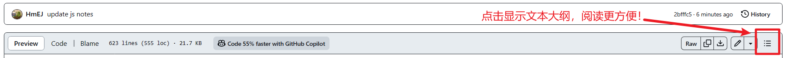

# 学习笔记

我使用的markdown编辑器是Obsidian，不是IDEA或者Typora。

由于不同编辑器对markdown语法的解释稍微有点差异，所以上传的md文件可能格式/排版不对 (在我自己这里是正常显示的)。

---

## 笔记

知识点

1. [👉重要知识点汇总📕](重要知识点汇总📖.md)
2. [👉Git笔记📖](Git.md)
3. [👉JVM📖](JVM组成.md)
   

前端

1. [👉HTML基础📖](1-HTML基础.md)
2. [👉CSS📖](2-CSS.md)
3.  [👉JavaScript📖](JavaScript.md)
4. [👉Ajax📖](Ajax.md)
5. [👉VUE📖](VUE.md)

 JavaSE

1. [👉JAVA入门📖](3-Java%20SE%20入门.md)
2. [👉方法📖](4-方法.md)
3. [👉数组📖](5-数组.md)
4. [👉面向对象📖](6-面向对象.md)
5. [👉异常处理📖](7-异常处理.md)
6. [👉常用类📖](8-常用类.md)
7. [👉集合📖](9-集合.md)
8. [👉IO流📖](10-IO流.md)
9. [👉多线程📖](11-多线程.md)
10. [👉网络编程📖](12-网络编程.md)
11. [👉反射📖](13-反射.md)
12. [👉JDBC📖](14-JDBC.md)

JavaEE

1. [👉JavaWeb📖](JavaWeb.md)

---

## 框架

1. [👉Maven逆向工程自动生成MyBatis骨架](mybatis-generator.md)
2. [👉Spring学习记录|最后一天|完全体|10-6](SpringPractice10-6/学习记录10-6.md)
3. [👉SpringMVC学习记录|第一天|HelloWord阶段|10-7](SpringMVC/SpringMVC学习记录10-7.md)
4. [👉SpringMVC学习记录|第二天|10-8](SpringMVC02/SpringMVC学习记录第二天10-8.md)
5. [👉SSM整合](ssm-integration/记录.md)

## 面试记录

由于前三次面试，记录人员记录的并不规范，整理难度较大，所以我懒得整理了，从第四次开始，之后的面试记录我会整理好。前三次面试记录我上传一个[doc文档](面试记录.docx)吧

> 面试记录规范： [文档](面试记录规范文档.md)

1. 🚫第一次面试8-28
1. 🚫第二次面试8-30
1. 🚫第三次面试9-1
1. 🚫第四次面试9-4
1. [👉第四次面试9-8](面试记录9-8.md)

---

## 小组测试

1. [👉数组测验💯](面试简单题测试.md)
2. [👉异常和常用类测验💯](模拟测试摸底题.md)
3. [👉集合测验💯](集合中难测试题.md)
4. [👉IO流测验💯](IO流简单测试题.md)
5. [👉线程测验💯](线程简单测试题.md)
6. [👉SQL测验💯](SQL简单测试题.md)
    附: 💾[sql文件](tb_order.sql)

---

## 组长の笔记

组长的笔记：👉[Jinhui-Huang的笔记](组长笔记)👈

关注我的组长：👉👈
