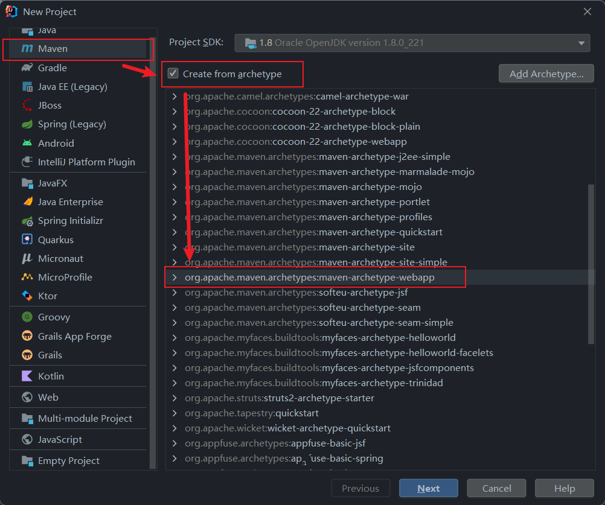
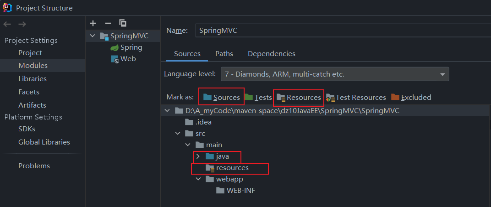

# SpringMVC学习记录第一天 HelloWord阶段   10-7

## SpringMVC组件

1. **DispatcherServlet 前端控制器**

是SpringMVC的核心组件之一，负责接收所有的HTTP请求并将它们路由到适当的处理程序(Handler)。还处理视图解析和渲染

2. **HandlerMapping 处理器映射器**

用于确定请求应该由哪个处理器(Handler)来执行

3. **HandlerAdapter 处理器适配器**

负责执行处理器(Handler)，拿到返回结果ModelAndView后交给前端处理器解析和渲染

4. **Handler 处理器/控制器**

负责处理前端请求，完成业务逻辑，返回ModelAndView给HandlerAdapter

5. **ViewResolver 视图解析器**

负责将前端控制器中拿到的ModelAndView解析出路径并生成View
对象交由前端控制器来渲染页面


## SpringMVC控制流程


## 1. 快速构建一个maven Web项目

1. 由webapp模板创建maven项目



2. 创建java目录和resources目录



## 2. 配置依赖

```xml
    <dependency>
      <groupId>junit</groupId>
      <artifactId>junit</artifactId>
      <version>4.11</version>
      <scope>test</scope>
    </dependency>

    <!--Spring的5大核心jar包 -->
    <!--依赖于commons-logging日志管理 -->
    <dependency>
      <groupId>commons-logging</groupId>
      <artifactId>commons-logging</artifactId>
      <version>1.2</version>
    </dependency>

    <!--提供了框架的基本组成部分,包括IOC 和 DI-->
    <dependency>
      <groupId>org.springframework</groupId>
      <artifactId>spring-core</artifactId>
      <version>4.1.6.RELEASE</version>
    </dependency>

    <!-- 提供了BeanFactory-->
    <dependency>
      <groupId>org.springframework</groupId>
      <artifactId>spring-beans</artifactId>
      <version>4.1.6.RELEASE</version>
    </dependency>

    <!--上下文配置对象，提供一个框架式的对象访问方式-->
    <dependency>
      <groupId>org.springframework</groupId>
      <artifactId>spring-context</artifactId>
      <version>4.1.6.RELEASE</version>
    </dependency>

    <!--提供了强大的表达式语言-->
    <dependency>
      <groupId>org.springframework</groupId>
      <artifactId>spring-expression</artifactId>
      <version>4.1.6.RELEASE</version>
    </dependency>

    <!--springMVC的jar包-->
    <dependency>
      <groupId>org.springframework</groupId>
      <artifactId>spring-web</artifactId>
      <version>4.1.6.RELEASE</version>
    </dependency>

    <dependency>
      <groupId>org.springframework</groupId>
      <artifactId>spring-webmvc</artifactId>
      <version>4.1.6.RELEASE</version>
    </dependency>

    <!--java web依赖 -->
    <dependency>
      <groupId>javax.servlet</groupId>
      <artifactId>servlet-api</artifactId>
      <version>2.3</version>
    </dependency>

    <dependency>
      <groupId>javax.servlet.jsp</groupId>
      <artifactId>jsp-api</artifactId>
      <version>2.2</version>
    </dependency>

    <!-- jstl表达式 -->
    <dependency>
      <groupId>jstl</groupId>
      <artifactId>jstl</artifactId>
      <version>1.2</version>
    </dependency>

    <dependency>
      <groupId>taglibs</groupId>
      <artifactId>standard</artifactId>
      <version>1.1.2</version>
    </dependency>
```

## 3. 创建IoC容器

在resources目录下新建一个spring配置文件

```xml
<?xml version="1.0" encoding="UTF-8"?>
<beans xmlns="http://www.springframework.org/schema/beans"
       xmlns:xsi="http://www.w3.org/2001/XMLSchema-instance"
       xmlns:context="http://www.springframework.org/schema/context"
       xmlns:mvc="http://www.springframework.org/schema/mvc"
       xsi:schemaLocation="http://www.springframework.org/schema/beans
        http://www.springframework.org/schema/beans/spring-beans.xsd
        http://www.springframework.org/schema/mvc
        http://www.springframework.org/schema/mvc/spring-mvc.xsd
        http://www.springframework.org/schema/context
        http://www.springframework.org/schema/context/spring-context.xsd">

    <!-- 扫包 -->
    <context:component-scan base-package="com.mh.controller"/>

    <!-- 默认加载注解处理器映射器和处理器适配器及很多的参数绑定 -->
    <mvc:annotation-driven/>
    
</beans>
```

## 4. 配置 web.xml

在web.xml中配置SpringMVC的核心：DispatcherServlet 

DispatcherServlet也叫前端控制器，是SpringMVC最核心的部分，所有的请求都会通过它来进行处理。它本质上也是一个Servlet，注册Servlet两种方式：通过注解 和 通过xml配置文件。由于不能通过 注解方式来注册这个Servlet，所以只能用xml配置方式来注册。

```xml
  <servlet>
    <servlet-name>springmvc</servlet-name>
    <servlet-class>org.springframework.web.servlet.DispatcherServlet</servlet-class>
    <!--init-param 告诉ServletSpringMVC配置文件在哪里 -->
    <init-param>
      <param-name>contextConfigLocation</param-name>
      <param-value>classpath:applicationContext.xml</param-value>
    </init-param>
    <!-- 自启动-在启动tomcat时立即加载对应的Servlet -->
    <load-on-startup>1</load-on-startup>
  </servlet>

  <servlet-mapping>
    <servlet-name>springmvc</servlet-name>
    <!-- /的意思是：除了JSP放行,其他全按照名称去找@RequestMapping() -->
    <url-pattern>/</url-pattern>
  </servlet-mapping>
```

## 5. 写控制层代码

ModelAndView的作用域和request作用域是一样的。

```java
package com.mh.controller;

import org.springframework.stereotype.Controller;
import org.springframework.web.bind.annotation.RequestMapping;
import org.springframework.web.servlet.ModelAndView;

@Controller    //bean注册
public class UserController {

    @RequestMapping("reg.do")   //请求路径映射

    public ModelAndView show(String username,String password) {
        ModelAndView mv = new ModelAndView();

        if ("zhangsan".equals(username) && "123".equals(password)){
            mv.setViewName("success.jsp");  //页面转发
            mv.addObject("uname",username);   //传参
            return mv;
        }else {
            mv.setViewName("index.jsp");
            return mv;
        }

    }
}
```

## 6. 前端页面

index.jsp

```jsp
<%@ page contentType="text/html;charset=UTF-8" language="java" %>
<html>
<body>
    <h2>Hello World!</h2>
    <form action="reg.do" method="post">
        用户名：<input type="text" name="username"><br/>
        密码：<input type="password" name="password"/><br/>
        <input type="submit" value="提交">
    </form>
</body>
</html>
```

success.jsp

```jsp
<%@ page contentType="text/html;charset=UTF-8" language="java"  isELIgnored="false"%>
<html>
<head>
    <title>Title</title>
</head>
<body>
  登陆成功, ${uname} , 欢迎您！
</body>
</html>
```
> 注意在JSP页面的头文件中 将 `isELIgnored` 属性设为 `false` ，这样该JSP页面就会解析JSP的 EL表达式