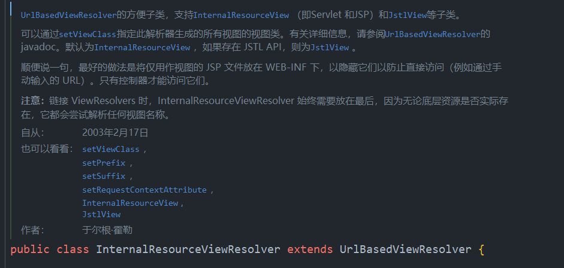
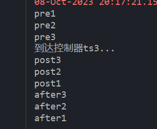

# SpringMVC学习记录第二天10-8

## 创建SpringMVC项目步骤

1. 先在web.xml中配置DispatcherServlet(前端控制器)，全局编码过滤器等
2. resources下新建IoC容器，设置扫包，注解驱动，视图解析器，MVC拦截器等
3. 创建对应java代码

## 配置全局字符编码过滤器

```html
<filter>
    <filter-name>charset</filter-name>
    <filter-class>org.springframework.web.filter.CharacterEncodingFilter</filter-class>
    
<init-param>
    <param-name>encoding</param-name>
    <param-value>utf-8</param-value>
</init-param>
    
<init-param>
    <param-name>forceEncoding</param-name>
    <param-value>true</param-value>
</init-param>
    
</filter>

<filter-mapping>
    <filter-name>charset</filter-name>
    <url-pattern>/*</url-pattern>
</filter-mapping>
```
## SpringMVC的二级路由

类的@RequestMapping注解中的路径是一级路由，方法的@RequestMapping注解的路径是二级路由 

在控制器方法里，页面跳转都是从一级路由开始跳的。如果配置了视图解析器，那就不需要我们来考虑路径问题了，因为视图解析器已经帮我们解析好了

## 请求映射 @RequestMapping

这个注解用于维护controller的映射地址，参数，接受的请求方法等属性

1. **value 映射地址**

如果映射地址只有一个，那么这个value可以省略 即可以写成 `@RequestMapper("login")` 这种形式

如果映射地址有多个，就必须写完整了，要加上value 即 `@RequestMapper(value = {"login","nothing"})`

2. **method 可接受的请求方法**

该属性用于限制controller允许接收的方法，方法值是枚举类型，有如下可选：`GET, HEAD, POST, PUT, PATCH, DELETE, OPTIONS, TRACE`

如果不写该属性，默认接收全部请求方法

例如： `@RequestMapping( method = {RequestMethod.POST} )`

3. **params 限制参数**

该属性可以限定请求中需要出现哪些参数，或者限定特定参数的值。

例如: `@RequestMapping(params = {"ename=zhangsan"} )` 限定请求中的ename参数的值为`zhangsan`。只有满足该需求才能执行该handler方法。

## 返回值类型

SpringMVC Controller有三种返回值类型: `ModelAndView`, `String`, `Void`

1. ModelAndView 存储数据，设置视图
2. String 设置视图 使用Model传递数据
3. Void 

### String作为返回值类型

在return中加上 forward 或者 redirect ，那么路径跳转就不会走视图解析器,并且路径是从一级路由开始起跳。如果直接返回一个视图名称，那么该路径将会被视图解析器解析处理。

> 当使用forward:或redirect:前缀时，Spring MVC会将请求直接转发或重定向到指定的URL，而不会走视图解析器。这是因为明确指定了要进行的操作，而不是将返回的字符串解析为视图名称。

例如： 

`return "forward:/ok"` 

跳转失败，不走视图解析器，找不到/login页面(因为这不是一个jsp页面)

`return "/ok"`

跳转成功，这个返回的是视图名称，会经过视图解析器处理，自动拼接上`.jsp` 从而正确跳转。

### 视图解析器配置

```xml
<!--视图解析器-->
<!--配置视图解析器-->
<bean class="org.springframework.web.servlet.view.InternalResourceViewResolver">
    <!-- prefix属性推荐配置为/WEB-INF/ -->
    <property name="prefix" value="/"/> 
    <property name="suffix" value=".jsp"/>
</bean>
```
查看`InternalResourceViewResolver`源码，作者告诉我们，建议将仅用作视图的 jsp 文件放在 WEB-INF 下以防止直接访问:




## 参数绑定

1. 简单参数绑定 

在处理器方法的参数列表中填入形参即可，如果形参和前端的参数名称不一样，可以通过@RequestParam注解来指定接收的参数名

```java
public String test1(Integer empno, @RequestParam(value = "ename",defaultValue = "zhangsan") String name, Model model, HttpSession session){
    session.setAttribute("info", name);
    if (empno==123 && "zhangsan".equals(name)){
        return "/ok";
    }else {
        return "redirect:/";
    }
}
```

2. POJO参数绑定 

直接在参数列表中填入POJO对象

```java
public ModelAndView test3(Emp emp){
    ModelAndView mv = new ModelAndView();
    mv.addObject("info",emp);
    /*跳到另外一个处理方法中去*/
    mv.setViewName("forward:/emp/show");
    return mv;
}
```

## 拦截器 interceptor

1. 创建拦截器类，实现HandlerInterceptor接口

```java
/*自定义拦截器*/
public class MyHandler implements HandlerInterceptor {
    /*
     * preHandle 发送请求到达处理器之前
     * 返回值如果为false, 则表示该请求被拦截。如果为true，则表示放行
     * */
    @Override
    public boolean preHandle(HttpServletRequest httpServletRequest, HttpServletResponse httpServletResponse, Object o) throws Exception {
        /*在控制器方法执行前*/
        System.out.println("请求到达preHandle拦截方法");
        return true; 
    }

    @Override
    public void postHandle(HttpServletRequest httpServletRequest, HttpServletResponse httpServletResponse, Object o, ModelAndView modelAndView) throws Exception {
        System.out.println("控制器方法结束，视图渲染前进入 ...");
    }

    @Override
    public void afterCompletion(HttpServletRequest httpServletRequest, HttpServletResponse httpServletResponse, Object o, Exception e) throws Exception {
        /*视图渲染之后执行*/
        System.out.println("视图渲染完毕，执行afterCompletion方法");
    }
}
```
> preHandle方法在handler方法执行之前执行。返回一个boolean值，为true表示放行，为false表示拦截
> 
> postHandle方法在handler方法执行之后，dispatcher渲染视图之前执行。**如果任何一个拦截器的preHandle方法返回了一个false值或者抛出异常，或者handler方法抛出异常，postHandle都不会执行**
>
> afterCompletion方法在dispatcher渲染视图后执行，**无论handler方法是否抛出异常都会执行**

>如果有多个拦截器，则执行方式是链式的，且preHandle方法的执行顺序和剩下两个方法执行顺序相反。
> 比如 现在有三个拦截器，第一个拦截器preHandle中输出 "pre1" 字样，第二个拦截器preHandle中输出 "pre2" 字样，以此类推。在IoC容器中配置完后，运行程序，得到的结果会是： pre1, pre2, pre3, post3, post2, post1, after3, after2, after1



2. 在IoC容器中配置拦截器

```xml
<!--拦截器-->
<mvc:interceptors>
    <mvc:interceptor>
        <mvc:mapping path="/**" />
<!--  <mvc:exclude-mapping path="/emp"/> 二级路径  -->
        <bean class="com.handler.MyHandler"/>
    </mvc:interceptor>

    <mvc:interceptor>
        <mvc:mapping path="/**"/>
        <bean class="com.handler.MyHandler2"/>
    </mvc:interceptor>

    <mvc:interceptor>
        <mvc:mapping path="/**"/>
        <bean class="com.handler.MyHandler3"/>
    </mvc:interceptor>

</mvc:interceptors>
```

