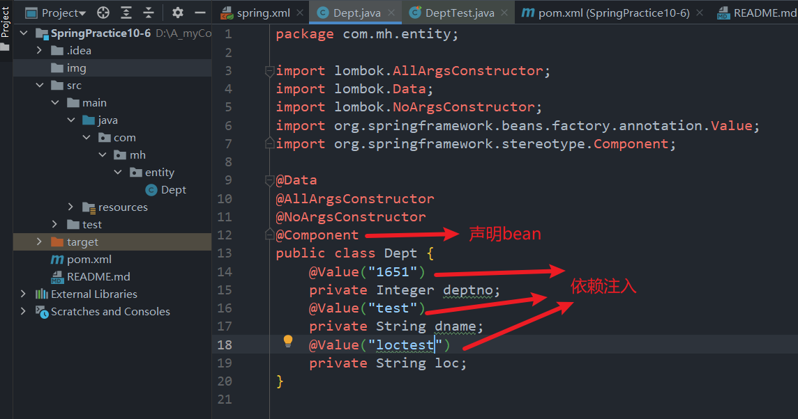
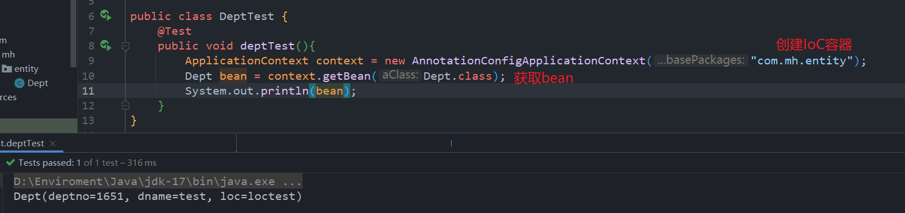
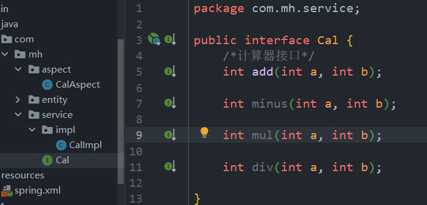
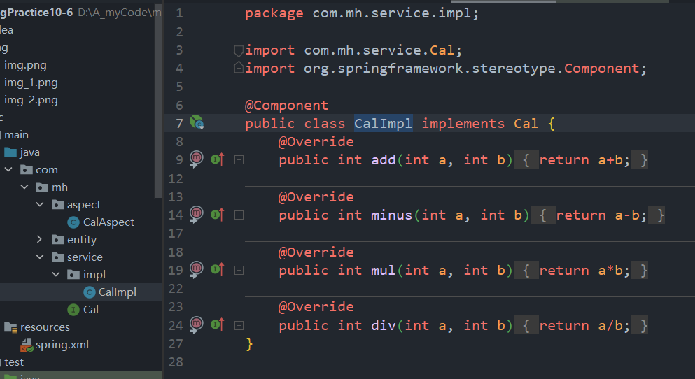
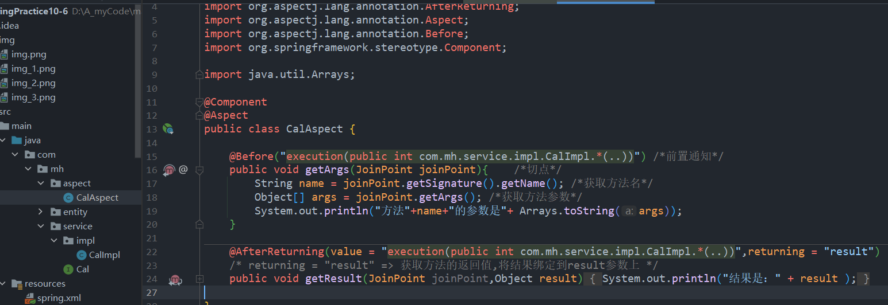
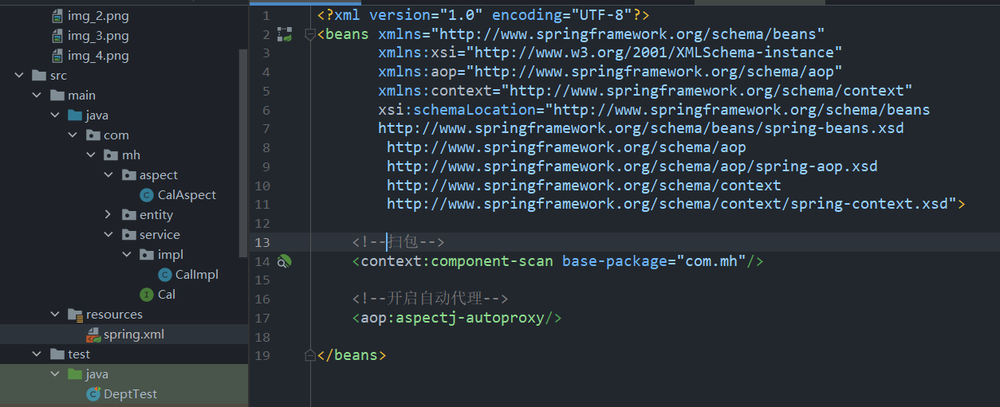
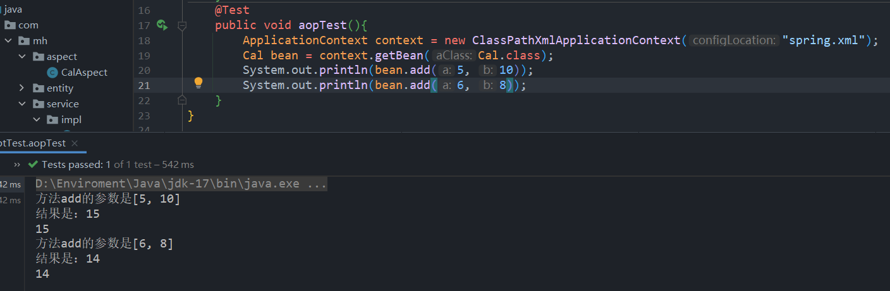
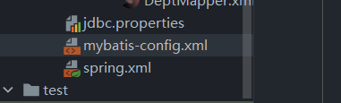
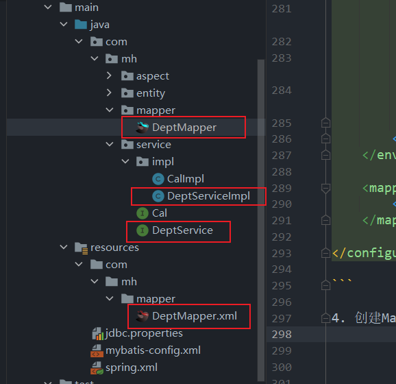
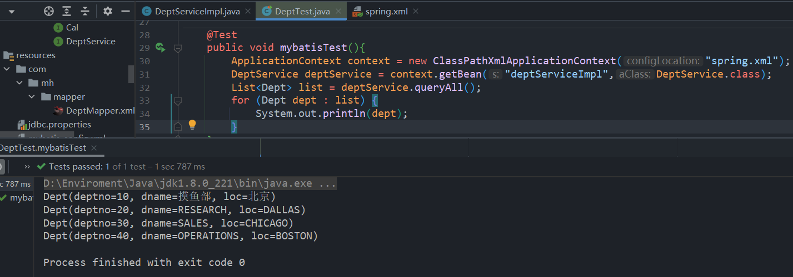

2023-10-6

Spring学习最后一天

#今日练习：

## 创建IoC容器

1. 创建实体类 并且依赖注入



2. 创建IoC容器，测试




## 基于注解的AOP

1. 建接口和实现类

接口：



实现类：



2. 建切面类，写方法



3. 开启扫包和自动代理



4. 测试



## mybatis和spring的整合

1. 导入依赖 ( 学习过程中大部分问题都是依赖版本导致的 )

```xml
    <dependencies>
        <!--进行junit单元测试 -->
        <dependency>
            <groupId>junit</groupId>
            <artifactId>junit</artifactId>
            <version>4.11</version>
            <scope>test</scope>
        </dependency>

        <!--依赖于commons-logging日志管理 -->
        <dependency>
            <groupId>commons-logging</groupId>
            <artifactId>commons-logging</artifactId>
            <version>1.2</version>
        </dependency>

        <!--上下文配置对象，提供一个框架式的对象访问方式-->
        <dependency>
            <groupId>org.springframework</groupId>
            <artifactId>spring-context</artifactId>
            <version>5.3.12</version>
        </dependency>

        <!-- 注解式声明切面  -->
        <dependency>
            <groupId>org.aspectj</groupId>
            <artifactId>aspectjweaver</artifactId>
            <version>1.9.7</version>
        </dependency>


        <!-- https://mvnrepository.com/artifact/org.projectlombok/lombok -->
        <dependency>
            <groupId>org.projectlombok</groupId>
            <artifactId>lombok</artifactId>
            <version>1.18.24</version>
            <scope>provided</scope>
        </dependency>

<!--        &lt;!&ndash; slf4j日志门面 &ndash;&gt;-->
<!--        <dependency>-->
<!--            <groupId>org.slf4j</groupId>-->
<!--            <artifactId>slf4j-api</artifactId>-->
<!--            <version>1.7.26</version>-->
<!--        </dependency>-->
<!--        &lt;!&ndash; logback日志实现 &ndash;&gt;-->
<!--        <dependency>-->
<!--            <groupId>ch.qos.logback</groupId>-->
<!--            <artifactId>logback-classic</artifactId>-->
<!--            <version>1.2.3</version>-->
<!--        </dependency>-->

        <!--  https://mvnrepository.com/artifact/org.projectlombok/lombok  -->
        <dependency>
            <groupId>org.projectlombok</groupId>
            <artifactId>lombok</artifactId>
            <version>1.18.22</version>
            <scope>provided</scope>
        </dependency>

        <!-- mybatis核心包-->
        <dependency>
            <groupId>org.mybatis</groupId>
            <artifactId>mybatis</artifactId>
            <version>3.5.3</version>
        </dependency>

        <!-- mysql驱动包 -->
        <dependency>
            <groupId>mysql</groupId>
            <artifactId>mysql-connector-java</artifactId>
            <version>8.0.33</version> <!-- 使用最新版本 -->
        </dependency>


        <!--整合Spring + Mybatis -->
        <dependency>
            <groupId>org.mybatis</groupId>
            <artifactId>mybatis-spring</artifactId>
            <version>1.3.0</version>
        </dependency>

        <!-- 导入dbcp的jar包，用来在spring-mybatis.xml中配置数据库 -->
        <dependency>
            <groupId>commons-dbcp</groupId>
            <artifactId>commons-dbcp</artifactId>
            <version>1.4</version>
        </dependency>

        <dependency>
            <groupId>org.springframework</groupId>
            <artifactId>spring-tx</artifactId>
            <version>4.3.18.RELEASE</version>
        </dependency>

        <!--对Spring 对JDBC 数据访问进行封装的所有类-->
        <dependency>
            <groupId>org.springframework</groupId>
            <artifactId>spring-jdbc</artifactId>
            <version>4.1.6.RELEASE</version>
        </dependency>
        
    </dependencies>
```
2. 新增jdbc.properties , mybatis-config.xml配置文件



jdbc.properties👇

```xml
driverClass = com.mysql.cj.jdbc.Driver
url = jdbc:mysql://localhost:3306/testdb
user = root
password = root
```
mybatis-config.xml👇

```xml
<?xml version="1.0" encoding="UTF-8" ?>
<!DOCTYPE configuration
        PUBLIC "-//mybatis.org//DTD Config 3.0//EN"
        "http://mybatis.org/dtd/mybatis-3-config.dtd">
<configuration>
    <typeAliases>
        <package name="com.mh.entity"/>
    </typeAliases>
</configuration>
```

3. 配置spring.xml

配置步骤：

a. 加载外部属性文件(jdbc.properties)

b. 配置数据库连接池(这里使用dbcp)

c. 配置SqlSessionFactoryBean  

    在正常使用mybatis时, 需要先创建一个SqlSessionFactory, 然后才能创建SqlSession. 这里的配置步骤就是将SqlSessionFactory这个对象通过IoC容器创建出来

d. 配置Mapper扫描器
    
    替代了在mybatis-config.xml中的<mappers></mappers>标签, 就是将映射文件的获取交给spring来处理, mybatis-config.xml什么都不用干了

spring.xml 👇

```xml
<?xml version="1.0" encoding="UTF-8"?>
<beans xmlns="http://www.springframework.org/schema/beans"
       xmlns:aop="http://www.springframework.org/schema/aop"
       xmlns:context="http://www.springframework.org/schema/context"
       xmlns:xsi="http://www.w3.org/2001/XMLSchema-instance"
       xmlns:tx="http://www.springframework.org/schema/tx"
       xsi:schemaLocation="http://www.springframework.org/schema/beans
       http://www.springframework.org/schema/beans/spring-beans.xsd
       http://www.springframework.org/schema/aop
       http://www.springframework.org/schema/aop/spring-aop-4.3.xsd
       http://www.springframework.org/schema/context
       http://www.springframework.org/schema/context/spring-context-4.3.xsd
       http://www.springframework.org/schema/tx
       http://www.springframework.org/schema/tx/spring-tx-4.3.xsd">
    <!--加载外部属性文件-->
    <!-- 相当于mybatis-config.xml中的 <properties resource="jdbc.properties"/> -->
    <context:property-placeholder location="jdbc.properties"/>

    <!-- 配置数据库连接池dbcp  -->
    <!-- 相当于mybatis-config.xml中的<dataSource></dataSource>步骤 -->
    <bean id="dataSource" class="org.apache.commons.dbcp.BasicDataSource">
        <property name="driverClassName" value="${driverClass}"/>
        <property name="url" value="${url}"/>
        <property name="username" value="${user}"/>
        <property name="password" value="${password}"/>
    </bean>

    <!--配置SqlSessionFactoryBean-->
    <!-- 创建SqlSessionFactory对象 -->
    <bean id="factory" class="org.mybatis.spring.SqlSessionFactoryBean">
        <property name="dataSource" ref="dataSource"/>
        <property name="configLocation" value="mybatis-config.xml"/>
    </bean>

    <!--配置Mapper扫描器-->
    <!-- 相当于mybatis-config.xml中的<mappers></mappers> -->
    <bean class="org.mybatis.spring.mapper.MapperScannerConfigurer">
        <property name="basePackage" value="com.mh.mapper"/>
        <property name="sqlSessionFactoryBeanName" value="factory"/>
    </bean>

    <!--扫包-->
    <!-- 为了获取基于注解的bean对象声明 -->
    <context:component-scan base-package="com.mh"/>

    <!--开启自动代理-->
    <!-- 服务于AOP -->
    <aop:aspectj-autoproxy/>

    <!--配置事务管理-->
    <bean id="txManager" class="org.springframework.jdbc.datasource.DataSourceTransactionManager">
        <property name="dataSource" ref="dataSource"/>
    </bean>

    <!--配置事务支持注解-->
    <tx:annotation-driven transaction-manager="txManager"/>
    
</beans>
```

这里贴上mybatis-config.xml的一个典型配置, 以供横向对比。可以看到在spring和mybatis进行整合的过程中, spring '抢走了' mybatis的大部分工作。mybatis几乎什么都不用干了

```xml
<?xml version="1.0" encoding="UTF-8" ?>
<!DOCTYPE configuration
        PUBLIC "-//mybatis.org//DTD Config 3.0//EN"
        "http://mybatis.org/dtd/mybatis-3-config.dtd">

<configuration>
    <properties resource="jdbc.properties"></properties>

    <settings>
        <setting name="lazyLoadingEnabled" value="true"/>
        <setting name="cacheEnabled" value="true"/>
    </settings>
    
    <typeAliases>
        <package name="com.mh.entity"/>
        <package name="com.mh.vo"/>
    </typeAliases>

    <environments default="development">
        <environment id="development">
            <transactionManager type="JDBC"></transactionManager>
            <dataSource type="POOLED">
                <property name="driver" value="${driver}"/>
                <property name="url" value="${url}"/>
                <property name="username" value="${username}"/>
                <property name="password" value="${password}"/>
            </dataSource>
        </environment>
    </environments>
    
    <mappers>
        <package name="com.mh.mapper"/>
    </mappers>
    
</configuration>

```

4. 创建Mapper接口和映射文件, 以及service层方法



mapper接口
```java
package com.mh.mapper;

import com.mh.entity.Dept;

import java.util.List;

public interface DeptMapper {

    List<Dept> selectAllDept();
}
```
映射文件
```xml
<?xml version="1.0" encoding="UTF-8"?>
<!DOCTYPE mapper PUBLIC "-//mybatis.org//DTD Mapper 3.0//EN"
        "http://mybatis.org/dtd/mybatis-3-mapper.dtd">
<mapper namespace="com.mh.mapper.DeptMapper">

    <select id="selectAllDept" resultType="dept">
        select * from dept
    </select>

</mapper>
```
服务层接口和方法

```java
/*接口*/
package com.mh.service;

import com.mh.entity.Dept;

import java.util.List;

public interface DeptService {

    List<Dept> queryAll();
}

/*方法*/
package com.mh.service.impl;

import com.mh.entity.Dept;
import com.mh.mapper.DeptMapper;
import com.mh.service.DeptService;
import org.springframework.beans.factory.annotation.Autowired;
import org.springframework.stereotype.Service;

import java.util.List;

@Service //声明bean对象
public class DeptServiceImpl implements DeptService {

    private final DeptMapper mapper;

    @Autowired//可省略        //通过构造函数来 注入mapper对象
    public DeptServiceImpl(DeptMapper mapper) {
        this.mapper = mapper;
    }

    @Override
    public List<Dept> queryAll() {
        return mapper.selectAllDept();
    }
}

```

5. 测试

以上步骤准备完毕，可以开始测试了

```java
@Test
public void mybatisTest(){
    ApplicationContext context = new ClassPathXmlApplicationContext("spring.xml");  //通过类路径xml方式来创建IoC容器
    DeptService deptService = context.getBean("deptServiceImpl",DeptService.class);   //获取服务层实现类对象
    List<Dept> list = deptService.queryAll();   //调用查询方法
    for (Dept dept : list) {
        System.out.println(dept);   //输出结果
    }
}
```
运行结果：



## 基于注解的声明式事务

1. 首先导入pom依赖

```xml
<dependency>
    <groupId>org.springframework</groupId>
    <artifactId>spring-tx</artifactId>
    <version>4.3.18.RELEASE</version>
</dependency>
```

2. 在spring配置文件中开启事务管理和注解支持

```xml
<!--配置事务管理-->
<bean id="txManager" class="org.springframework.jdbc.datasource.DataSourceTransactionManager">
    <property name="dataSource" ref="dataSource"/>
</bean>

<!--配置事务支持注解-->
<tx:annotation-driven transaction-manager="txManager"/>
```

3. 在服务层通过注解配置事务传播策略

```java
package com.mh.service.impl;

import com.mh.entity.Dept;
import com.mh.mapper.DeptMapper;
import com.mh.service.DeptService;
import org.springframework.beans.factory.annotation.Autowired;
import org.springframework.stereotype.Service;
import org.springframework.transaction.annotation.Propagation;
import org.springframework.transaction.annotation.Transactional;

import java.util.List;

@Service
@Transactional(propagation = Propagation.REQUIRED)   //配置事务传播策略  propagation [ˌprɒpə'ɡeɪʃ(ə)n] n.传播 扩展 宣传 培养
public class DeptServiceImpl implements DeptService {

    private final DeptMapper mapper;

    @Autowired        //通过构造函数来 注入mapper对象
    public DeptServiceImpl(DeptMapper mapper) {
        this.mapper = mapper;
    }

    @Override
    public List<Dept> queryAll() {
        return mapper.selectAllDept();
    }
}

```

补充： Spring的事务传播策略 👇

```html
REQUIRED（默认）：如果当前没有事务，就创建一个新的事务。如果已经存在一个事务，就加入到这个事务中。这是最常用的传播策略。

SUPPORTS：如果当前没有事务，就以非事务方式执行方法；如果已经存在一个事务，就加入到这个事务中。支持当前事务，但不会创建新事务。

MANDATORY：方法必须在一个已存在的事务中执行，否则会抛出异常。如果没有事务存在，则会抛出 IllegalTransactionStateException 异常。

REQUIRES_NEW：创建一个新的事务，如果已经存在一个事务，就挂起当前事务，并在方法执行完成后，恢复挂起的事务。这意味着方法总是会在自己的事务中执行。

NOT_SUPPORTED：以非事务方式执行方法，如果当前存在事务，则挂起事务，执行完成后再恢复。这个策略适用于不需要事务支持的方法。

NEVER：方法必须在没有活动事务的情况下执行，否则会抛出异常。如果已经存在一个事务，则会抛出 IllegalTransactionStateException 异常。

NESTED：如果已经存在一个事务，就在一个嵌套的事务中执行方法。嵌套事务可以独立于外部事务进行提交或回滚。如果外部事务回滚，嵌套事务可以选择回滚或保存点。这个传播策略只在特定的事务管理器和数据库支持时才可用。

NESTED（JDBC支持）：与上面的嵌套传播策略类似，但仅在使用 JDBC 事务管理时使用。这个传播策略是 Spring 3.0 引入的。
```
>可以通过 `@Transactional` 注解或者在 Spring 配置文件中的 `<tx:method>` 元素来指定事务传播策略。