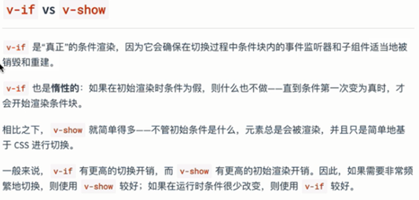
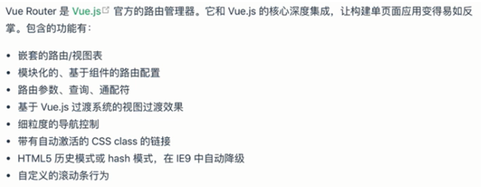
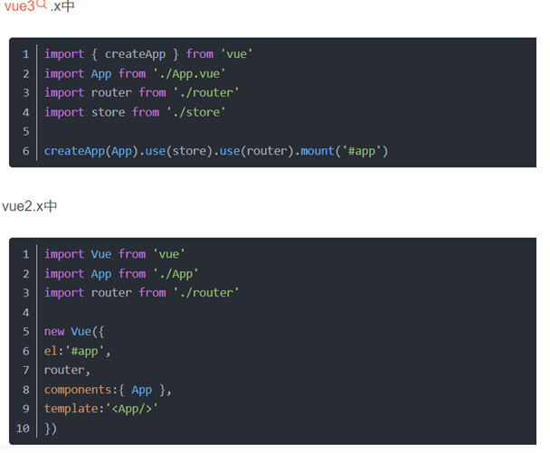

简单的vue示例：
```html
    <script src="../JS03/jquery/jquery-1.8.3.js"></script>
    <script src="js/vue.js"></script>
    <script>
        $(document).ready(function(){
            //通过vue将文本内容显示在div里
            let obj = new Vue({
                el:"div",
                data:{
                    hello : "hello vue!"
                }
            });

        });
    </script>
</head>
<body>
	//div中将显示 hello vue！
    <div>{{hello}}</div>   
</body>
```

如下是vue的完整应用：
```vue
<template>
  <div id="app">
    <!--  -->
    <!-- <HelloWorld msg="Welcome to Your Vue.js App"/> -->
    <div>
      <label :class="redcolor">
        👋Hi, welecome to my homework
        <br>
        now is 2023-9-5 16:16 Tuesday <br>
        edit by JoneElmo
      </label>
      <hr>
    </div>
    <h2>👇get options in selector</h2>
    choose your charactor:
    <select>
      <option>--default--</option>
      <option v-for="(elem,i) in names" :key="i">{{ elem }}</option>
    </select>
    <hr>
    <h2>👇change value via button-click</h2>
    boolean value now is <span>{{ boo_val }}</span>;
    <br>
    <button @click="changeBooVal">change boolean value btn</button>
    <hr>
    <h2>👇manipulate String</h2>
    the original String is :[<span>{{ str }}</span>]
    <br>
    <button @click="manipulateString">clike me to split and reverse the String</button> <br>
    <div :class="dontShow"> now the new String is :<span>{{ new_str }}</span> </div>
    <br>
    <hr>
    <h2>👇click button to display the table and click the table item to make age +1</h2>
    <button @click="showTable">click me to display the table</button>
    <table :class="display">
      <tr>
        <td>studentId</td>
        <td>studentName</td>
        <td>studentAge</td>
      </tr>
      <tr :class="{'color1':ele.hovered}" @click="clickToAdd(ele)" @mouseleave="leaveToChangeColor(ele)"  @mouseenter="hoverToChangeColor(ele)"  v-for="(ele,i) in students" :key="i">
        <td>{{ ele.sid }}</td>
        <td>{{ ele.sname }}</td>
        <td>{{ ele.sage }}</td>
      </tr>
    </table>
    <hr>
    <h2>👇learn the 'v-bind' also as ':'</h2>
    <a :class="changeStyle" :href="href" target="_blank">{{ href }}</a>
    <br>
    <button @click="changeLink">👉click me to change the href of hyperlink</button>
    <hr>
    ok, the last mission : Get values from both directions
    <form>
      username: <input v-model="username" type="text" placeholder="enter your username"> <br>
      password: <input v-model="password" type="password" placeholder="enter your password"> <br>
      <button @click="submit">click to submit</button>
    </form>
    <div>
      your info👇 <br>
      username:{{ username }} <br>
      password:{{ password }}
    </div>

  </div>
</template>

<script>
import HelloWorld from './components/HelloWorld.vue'

export default {
  name: 'App',
  data(){
    return{
      redcolor:"kk",
      names:["曹操","嬴异人","嬴政","嫪毐"],
      boo:true,
      boo_val:"true",
      str: "电风=扇电风扇发射=点发射点=发法撒=旦发",
      new_str:"",
      dontShow:"noshow",
      table:"tt",
      display:"donot_display",
      href : "http://www.baidu.com",
      changeStyle : "",
      username:"",
      password:"",
      students:[
        {"sid":"001","sname":"刘备","sage":46},
        {"sid":"002","sname":"孙权","sage":32},
        {"sid":"003","sname":"周瑜","sage":35},
        {"sid":"004","sname":"诸葛亮","sage":29},
        {"sid":"005","sname":"荀彧","sage":58}
      ]
    }
  },
  methods:{
    changeBooVal(){
      this.boo_val = !this.boo_val;
    },
    hoverToChangeColor(ele){
      ele.hovered = true;
    },
    leaveToChangeColor(ele){
      ele.hovered = false;
    },
    clickToAdd(ele){
      ele.sage = ele.sage+1;
    },
    showTable(){
      this.display="";
    },
    changeLink(){
      this.href="http://www.staggeringbeauty.com/";
      this.changeStyle = "sss";
    },
    submit(){
      alert(
        "here are your information : \n" +
        "username -> " + this.username +
        "\npasswrod -> " + this.password
      )
    }
  },
  computed:{
    manipulateString(){
      this.new_str = this.str.split("=").reverse();
      this.dontShow = false;
    }
  }
}
</script>

<style lang="less">
#app {
  font-family: Avenir, Helvetica, Arial, sans-serif;
  -webkit-font-smoothing: antialiased;
  -moz-osx-font-smoothing: grayscale;
  text-align: center;
  color: #2c3e50;
  margin-top: 10px;
}
.kk{
  color: red;
}
.noshow{
  display: none;
}
table td{
  border: 1px solid black;
}
table{
  margin-top: 1%;
  margin-left: 39%;
}
.color1{
  background-color: rgb(38, 212, 189);
}
.donot_display{
  display: none;
}
.sss{
  background-color: yellow;
  color: black;
  text-decoration: none;
  font-size: 25px;
}
form + div{
  border: 1px solid red;
  width: 300px;
  margin-left: 39%;
}
</style>

```
一个vue页面分为三个部分：
1. `<template> ` 部分 用于书写html语言
2. `<script>` 部分 书写JavaScript语句
3. `<style>` 部分 书写CSS语句
```vue
<template>
  
</template>

<script>
export default {

}
</script>

<style>

</style>
```
以上是一个vue页面的默认模板
### vue模板语法 data-return
```vue
//数据调用
<template>
	<p> {{str}} </p>
</template>
//对象定义
<script>
export default {
  name: 'app',
  data(){
    return{
      names:["勾三","股四","玄五"],
      boo02:true,
      stus:[
        {"stuid":"001","stuname":"zhangsan","sage":23},
        {"stuid":"002","stuname":"mohang","sage":21},
        {"stuid":"003","stuname":"yaoyao","sage":20}
      ],
      str:"时间佛i四==季度佛",
      hreff:"http://www.baidu.com",
      menu01 : ["科技新闻","军事新闻","八卦新闻"],
      menu02 : ["娱乐新闻","内陆新闻","国际新闻","网络新闻"]
    }
  }
}
</script>
```
### vue条件渲染 v-if/v-show



```vue
<template>
	<p v-if="flag">我是孙悟空</p>    //此语句将会被渲染
	<p v-else>我是六耳猕猴<p>   //此语句不会被渲染
	<p v-show="isShow">我是唐僧</p>   //此语句会被渲染但是被隐藏
</template>
<script>
	export default{
		data(){
			flag:true,
			isShow:false
		}
	}
</script>
```

### vue列表渲染 v-for
```vue
<template>
	<ul>
		<li v-for="(elements,index) in names" :key(index)>{{ elements }}</li> 
	</ul>
</template>
<script>
	export default{
		data(){
			names:["张三","李四","王五"]
		}
	}
</script>
```

### vue事件处理 methods | v-on: | @
```vue
//不带参事件处理
<template>
  <div>
    <button v-on:click="btn1Click">按钮</button>
    <!-- <button @click="btn1Click">按钮</button> -->
    <div class="box" v-on:mouseover="div1Over"></div>
    <!-- <div class="box" @mouseover="div1Over"></div>  -->
  </div>
</template>

<script>
export default {
    methods:{
        btn1Click(){
            console.log("点击")
        },
        div1Over(){
            console.log()
        }
    }
}
</script>
```
```vue
//带参事件处理--在调用方法时传参即可

```
### vue计算属性 computed
```vue
<template>
  <div>
    <div>{{ megMethod }}</div>
  </div>
</template>

<script>
export default {
	data(){
		return{
			meg :"fsodif==jsidf"
		}	
	},
	computed(){
		megMethod(){
			return this.meg.split("==");
		}
	}
}
</script>
```
>computed优点：不管调用了多少次，计算操作都只做一次。有缓存功能，如果数据不发生变化，就不会重新计算。

### vue绑定 v-bind : | : 

绑定css类样式：

`<div :class="{noShow:!'baga'}">hello!</div>`

`class=`后面可跟对象或数组。如果是对象，该对象的键必须是css样式中的**样式名称**，值是一个布尔类型的值，可以自定义。 在以上例子中，值设为了 `'baga'` 字符串。该字符串的布尔值将永为真。

```vue
// 绑定CSS样式 样式可以为单个对象，也可以为一个数组
<template>
  <p v-bind:class="[{color1:isShow},{color2:!isShow}]"></p> //该标签将会显示为绿色。 
</template>

<script>
export default {
    data(){
        return{
            isShow:false
        }
    }
}
</script>

<style>
    .color1{
        background-color: red;
    }
    .color2{
        background-color: green;
    }
</style>
//绑定超链接
<template>
    <div>
        <!-- 全写格式 -->
        <a v-bind:href="hrefurl"></a> 
        <!-- 简写格式 -->
        <a :href="hrefurl"></a>    
    </div>
</template>

<script>
export default {
    data(){
        return{
            isShow:false,
            hrefurl:"http://baidu.com"
        }
    }
}
</script>
```
### vue表单处理 watch
#### 双向数据绑定 v-model
```vue
<template>
  <div>
    <form>
      <input v-model="text" type="text">
    </form>
    <div>{{ text }}</div>  //input中输入的值会实时地显示在该div标签中
  </div>
</template>

<script>
export default {
  data(){
    return{
      text:""
    }
  }
}
</script>
```
```vue
//watch监视器 可以获取文本的变化情况
<template>
  <div>
    <form>
      <input v-model="text" type="text">
    </form>
    <div>{{ text }}</div>
  </div>
</template>

<script>
export default {
  data(){
    return{
      text:""
    }
  },
  watch:{    
    text(newval,oldval){    //两个参数，一个是新值(本次输入值)，一个是旧值(上次输入值)
      console.log(newval)     //文本的每次变化都会触发该事件
    }
  }
}
</script>
```
### vue引用组件
一个vue页面称为一个vue组件
- 引用其他vue组件的方式：
`import 指定组件名 from '组件路径'`（指定组件名是任意指定的，只需要与components属性中的组件名一致即可）
如：`import Appbb from './Appbb.vue'`
- 使用组件
只需要在`template`模块中将组件当成一个正常的html标签使用即可。
每个被使用的组件都是独立的，他们之间的数据**不共享**。

#### 子组件给父组件传值
**在子组件中使用 `$emit`：** 在子组件中，你可以使用`$emit`方法触发自定义事件，并传递数据给父组件。通常，你需要指定事件的名称和要传递的数据作为参数。父组件在调用该方法时即可拿到传递进来的参数。
```vue
//被引用的组件
<template>
    <div>
    </div>
</template>

<script>
export default {
    data(){
        return{
            isShow:false,
            hrefurl:"http://baidu.com"
        }
    },
    mounted(){
        this.$emit("sendMesg",this.hrefurl);
    }
}
</script>
```
```vue
//引用组件的组件
<template>
  <div>
    <div>被引用的给引用的传值： </div>
    <test @sendMesg="getMesg">  </test>
    {{ msg }}
  </div>
</template>

<script>

import test from './components/test.vue'

export default {
  data(){
    return{
      msg : ""
    }
  },
  components:{
    test : test
  },
  methods:{
    getMesg(mesg){
      this.msg = mesg;
    }
  }
}
</script>
```

### vue路由配置
前端路由：说白了就是通过不同的url，来访问不同的页面 这就是前端路由的概念。


首先前往main.js中进行路由配置。vue3.x 和 vue2.x稍有不同：


```js
import Vue from 'vue'
import App from './App.vue'
import test from './components/test.vue'   //导入路由指向的组件

import VueRouter from 'vue-router';   //导入路由库
Vue.config.productionTip = false
Vue.use(VueRouter)     //使用路由对象

//配置路由
const router = new VueRouter({   
  routes:[
    {
      path:"/",  //设置地址栏url
      component:test   //该url对应的组件
    }
  ]
})

new Vue({
  router,   //添加路由
  render: h => h(App),
}).$mount('#app')
```
在主页面中使用`<router-view></router-view>`来显示路由页面
当需要多条路由时，在`routes`中添加要配置的路由对象即可
```vue
<template>
  <div id="app">
    <router-view></router-view>
  </div>
</template>

<script>

export default {
  name: 'App',
  components: {
    
  }
}
</script>

```

