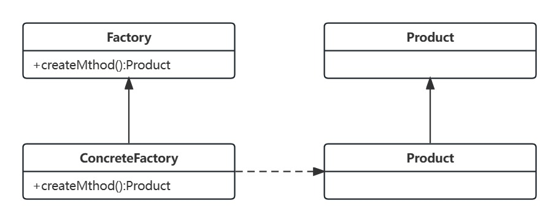
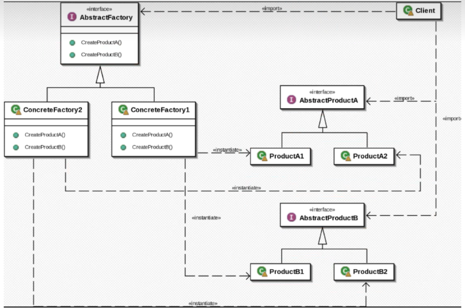
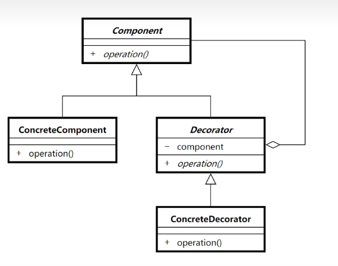

# 设计模式

## 单例模式

保证一个类只有一个实例，并提供一个全局访问点

场景：

重量级对象，不需要多个实例，比如线程池，数据库连接池

1. 懒汉式 

延迟加载 在使用时才创建对象

```java
public class Lazy {
    /*防止重排序*/
    private volatile static Lazy instance;
    private Lazy(){}  //私有构造器，防止别人在外部new一个实例
    public static Lazy getInstance(){
        if (instance==null){
            synchronized (Lazy.class){
                if (instance==null){
                    instance=new Lazy();
                    /*
                    * 字节码层：
                    * 1. 分配空间
                    * 2. 引用赋值
                    * 3. 初始化
                    * */
                }
            }
        }
        return instance;
    }
}
```
2. 饿汉式

类加载初始化阶段完成实例的初始化。本质上借助JVM类加载特性保证实例的唯一性, 由JVM来保证线程安全。

```java
public class Hungry {
    private static Hungry instance = new Hungry();

    private Hungry(){};

    public static Hungry getInstance(){
        return instance;
    }
}
```
3. 静态内部类式

通过静态内部类创建实例，本是上也是依赖JVM的类加载机制，是一种懒加载方式(调用getInstance方式时初始化实例)。

```java
public class InnerClassSingleton {
    
    private static class InnerClassHolder{
        private static InnerClassSingleton instance = new InnerClassSingleton();
    }
    
    private InnerClassSingleton(){
        /* 防止反射暴力获取实例 */
        if (InnerClassHolder.instance!=null){
            throw new RuntimeException("单例不允许多个实例");
        }
    }

    public InnerClassSingleton getInstance(){
        return InnerClassHolder.instance;
    }
}
```

静态内部类式的单例模式和饿汉式的单例模式都可以通过反射暴力破解。有没有免疫反射的单例模式呢？反射不能访问枚举类型，因此可以使用枚举类型来创造单例。

4. 枚举式单例

同样是由JVM来保证线程安全。通过javap命令反编译字节码文件，可以查看汇编码 

`javap -v EnumSingleton.class`

```java
public enum EnumSingleton {
    INSTANCE;

    public void print(){
        System.out.println(INSTANCE.hashCode());
    }
}
```
## 工厂方法模式

工厂父类提供创建产品的公共接口，工厂子类负责生成具体的产品。FactoryMethod使一个类的实例化延迟到子类。降低模块之间的耦合性。

**应用场景：**

1. 当你不知道该使用的对象的确切类型
2. 当你希望为库或框架提供扩展其内部组件的方法

**主要优点：**

1. 工厂方法负责创建业务需要的产品，同时隐藏了产品创建的具体细节，上层只需要关注产品对应的工厂类即可，降低了模块之间的耦合性
2. 当系统中需要加入新产品时，无需加入抽象工厂和抽象产品类，只需要添加具体的工厂类和产品类即可

### 工厂方法模式的四个角色



通用的工厂模式一般包含以下四个角色：

1. Factory 抽象工厂类，提供工厂的公共接口
```java
public abstract class Factory {
    public abstract <T>T createProduct(Class<T> clazz);
}
```
2. ConcreteFactory 具体工厂类，负责生成具体的产品
```java
public class ConcreteFactory extends Factory{
    @Override
    public <T> T createProduct(Class<T> clazz) {
        Product product = null;

        try {
            product = (Product) Class.forName(clazz.getName()).getConstructor().newInstance();
        } catch (Exception e) {
            e.printStackTrace();
        }
        return (T)product;
    }
}
```
3. Product 抽象产品类，是工厂类创建的所有产品的抽象父类，封装了产品的公共方法
```java
public abstract class Product {
    /*公共方法*/
    public void commonMethod(){}
    /*实例方法*/
    public abstract void method();
}
```
4. ConcreteProduct 具体产品类
```java
public class ConcreteProduct extends Product{
    @Override
    public void method() {
        /*方法逻辑*/
    }
}
```


### 工厂模式在源码中的应用：

简单工厂模式：

1.`Calendar.getInstance()` 通过传入不同的参数获取实例
2. `NumberFormat.getInstance()`

工厂方法模式：

1. `java.net.URLStreamHandlerFactory`
2. `javax.xml.bind.JAXBContext.createMarshaller`

## 抽象工厂模式

提供一个创建一系列相关或互相依赖对象的接口，而无需指定他们具体的类。



抽象工厂模式说白了就是一系列工厂方法模式的组合，可以创建一系列同族产品。

## 建造者模式

### 建造者模式四个角色

1. Product 产品 表示被创建的负责对象
```java
@Data
@AllArgsConstructor
@NoArgsConstructor
public class Product {
    private String carBody;
    private String carEngine;
    private String carTire;
}
```
2. Builder 抽象建造者 定义创建产品各个部件的抽象接口
```java
public interface Builder {
    void buildBody();
    void buildEngine();
    void buildTire();
    Product getResult();
}
```
3. ConcreteBuilder 具体建造者 完成产品各个部件的具体创建过程
```java
public class ConcreteBuilder implements Builder{
    private Product car;
    public ConcreteBuilder(){
        this.car = new Product();
    }

    @Override
    public void buildBody() {
        car.setCarBody("车身");
    }

    @Override
    public void buildEngine() {
        car.setCarEngine("引擎");
    }

    @Override
    public void buildTire() {
        car.setCarTire("轮胎");
    }

    @Override
    public Product getResult() {
        return car;
    }
}
```
4. Director 指挥者 使用建造者接口来创建产品
```java
public class Director {
    public Product constructCar(Builder builder){
        builder.buildBody();
        builder.buildEngine();
        builder.buildTire();
        return builder.getResult();
    }
}
```
## 原型模式

提供一种复制已有对象的方式来创建新的对象，而不是通过new一个实例来创建新的对象

### 原型模式的三个角色

1. Prototype 抽象原型类 定义一个抽象的克隆方法，用来复制现有对象
```java
public interface Prototype<T> {
    T clone();
}
```
2. ConcretePrototype 具体原型类 实现clone方法
```java
@Data
public class ConcretePrototype implements Prototype<ConcretePrototype>{
    private String name;
    public ConcretePrototype(String name){
        this.name = name;
    }

    @Override
    public ConcretePrototype clone() {
        return new ConcretePrototype(this.name);
    }
}
```
3. Client 客户端 通过调用clone方法来创建新的对象
```java
public class Client {
    public static void main(String[] args) {
        Prototype prototype = new ConcretePrototype("jone");
        Prototype obj = (Prototype) prototype.clone();
        System.out.println(obj);
    }
}
```
## 享元模式

尽可能减少内存使用量，通过共享对象来实现大量细粒度对象的有效管理

### 享元模式三角色

1. Flyweight 抽象享元 定义享元的公共方法，包含一个操作方法，其中需要使用到外部状态
```java
public interface Flyweight {
    void operation(String externalState);
}
```
2. ConcreteFlyweight 具体享元 实现方法，要能够共享
```java
public class ConcreteFlyweight implements Flyweight{
    private final String internalState;

    public ConcreteFlyweight(String internalState) {
        this.internalState = internalState;
    }

    @Override
    public void operation(String externalState) {
        System.out.println("ConcreteFlyweight-internalState:"+internalState +" externalState:"+externalState);
    }
}
```
3. FlyweightFactory 享元工厂 创建和管理所有享元，提供获取享元的方法
```java
public class FlyweightFactory {
    private final Map<String,Flyweight> flyweights = new HashMap<>();

    public Flyweight getFlyweight(String internalState){
        if (flyweights.containsKey(internalState)){
            return flyweights.get(internalState);
        }else {
            Flyweight flyweight = new ConcreteFlyweight(internalState);
            flyweights.put(internalState, flyweight);
            return flyweight;
        }
    }
}
```

享元模式的应用：

1. String, Integer, Long ...

## 门面模式/外观模式

为子系统的一组接口提供一个一致的接口

## 适配器模式

将一个接口转换成客户希望的另一个接口。使得原本由于接口**不兼容**而不能在一起工作的类能在一起工作

**适配器分为类适配器和对象适配器：**

**类适配器**实现方式就是适配器**继承原始类**并**实现目标接口** 这样会对适配器造成接口污染：即适配器即可调用原始类方法，也可以调用目标接口方法。

### 适配器模式三个角色

1. 原始接口
```java
class Adaptee{
    public int output220v(){
        return 220;
    }
}
```
2. 目标接口
```java
interface Target{
    int output5V();
}
```
3. 适配器
```java
/* 对象适配器模式 */
class Adapter implements Target{
    private Adaptee adaptee;

    public Adapter(Adaptee adaptee){
        this.adaptee = adaptee;
    }

    @Override
    public int output5V() {
        int i = adaptee.output220v();
        System.out.println("原始电压:"+i+" 输出电压:5");
        return 5;
    }
}

/* 类适配器模式 */
class Adapter extends Adaptee implements Target{
    @Override
    public int output5V() {
        int i = output220v();
        System.out.println("原始电压:"+i+" 输出电压:5");
        return 5;
    }
}
```
## 装饰器模式

在不改变原有对象的基础上，将功能附加到对象上



### 装饰器模式三个角色
1. 抽象组件
```java
interface Component{
    void operation();
}
```
2. 具体组件
```java
//拍照功能
class ConcreteComponent implements Component{

    @Override
    public void operation() {
        System.out.println("拍照");
    }
}
```
3. 装饰器
```java
//装饰器
abstract class Decorator implements Component{

    Component component;

    public Decorator(Component component){
        this.component = component;
    }
}
```
4. 具体装饰器
```java
/* 为相机添加美颜功能 */
class function extends Decorator{

    public function(Component component) {
        super(component);
    }

    @Override
    public void operation() {
        System.out.println("添加美颜");
        component.operation();
    }
}
```