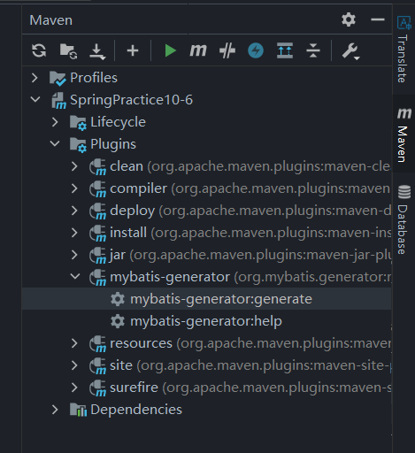
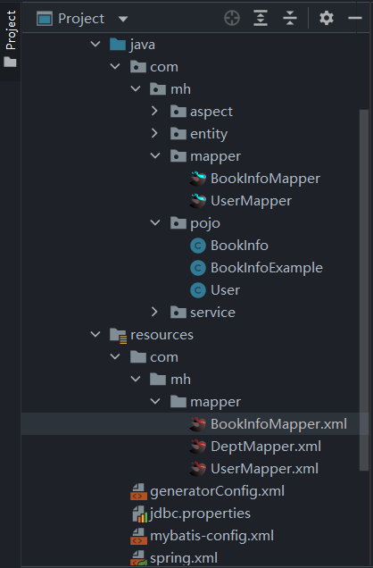

# 通过maven的mybatis-generator插件快速构建mybatis骨架

## 1. 需要的依赖

1. mybatis-generator-core

```xml
<dependency>
    <groupId>org.mybatis.generator</groupId>
    <artifactId>mybatis-generator-core</artifactId>
    <version>1.4.0</version>
</dependency>
```
2. mysql连接驱动

```xml
<!-- mysql驱动包 -->
<dependency>
    <groupId>mysql</groupId>
    <artifactId>mysql-connector-java</artifactId>
    <version>8.0.33</version> 
</dependency>
```

## 2. 配置插件

在build标签中配置maven插件

```xml
<build>
    <plugins>
        <!-- mybatis generator 自动生成代码插件 -->
        <plugin>
            <groupId>org.mybatis.generator</groupId>
            <artifactId>mybatis-generator-maven-plugin</artifactId>
            <version>1.4.0</version>
            <configuration>
                <!--配置文件路径-->>
                <configurationFile>src/main/resources/generatorConfig.xml</configurationFile>
                <overwrite>true</overwrite>
                <verbose>true</verbose>
            </configuration>
        </plugin>
    </plugins>
</build>
```

## 3. 配置文件generatorConfig.xml

上一步中在`<configuration>`中设置了配置文件的路径，下一步就是设置配置文件了

```xml
<?xml version="1.0" encoding="UTF-8"?>
<!DOCTYPE generatorConfiguration
        PUBLIC "-//mybatis.org//DTD MyBatis Generator Configuration 1.0//EN"
        "http://mybatis.org/dtd/mybatis-generator-config_1_0.dtd">
<!-- 配置生成器 -->
<generatorConfiguration>
    <context id="DB2Tables" targetRuntime="MyBatis3">

        <commentGenerator>
            <property name="suppressDate" value="true"/>
            <!-- 是否去除自动生成的注释 true：是 ： false:否 -->
            <property name="suppressAllComments" value="true"/>
        </commentGenerator>

        <!-- 数据库链接URL，用户名、密码 -->
        <jdbcConnection driverClass="com.mysql.cj.jdbc.Driver"
                        connectionURL="jdbc:mysql://localhost:3306/sshdbexam1"
                        userId="root"
                        password="root">
        </jdbcConnection>

        <!-- 类型转换 -->
        <javaTypeResolver>
            <!-- 是否使用BigDecimals，false可自动转化以下类型(Long Integer Short等) -->
            <property name="forceBigDecimals" value="false"/>
        </javaTypeResolver>

        <!-- 生成模型(实体类)的包名和位置-->
        <javaModelGenerator targetPackage="com.mh.pojo" targetProject="src/main/java">
            <property name="enableSubPackages" value="true"/>
            <property name="trimStrings" value="true"/>
        </javaModelGenerator>

        <!-- 生成映射文件(mapper.xml)的包名和位置-->
        <sqlMapGenerator targetPackage="com.mh.mapper" targetProject="src/main/resources">
            <property name="enableSubPackages" value="true"/>
        </sqlMapGenerator>

        <!-- 生成DAO (mapper) 的包名和位置 -->
        <javaClientGenerator type="XMLMAPPER" targetPackage="com.mh.mapper" targetProject="src/main/java">
            <property name="enableSubPackages" value="true"/>
        </javaClientGenerator>

        <!-- 要生成的表 tableName是数据库中的表名或视图名 domainObjectName是实体类名-->
        <table tableName="users" domainObjectName="User" enableCountByExample="false" enableUpdateByExample="false"
               enableDeleteByExample="false" enableSelectByExample="false" selectByExampleQueryId="false">
            <property name="useActualColumnNames" value="false"/>
            <!-- 数据库表主键 -->
            <generatedKey column="user_id" sqlStatement="Mysql" identity="true"/>
        </table>
        
        <table tableName="book_info" domainObjectName="BookInfo">
            <generatedKey column="book_id" sqlStatement="Mysql" identity="true"/>
        </table>
    </context>

</generatorConfiguration>
```
## 4. 配置完成，使用

点击 mybatis-generator:generate



生成的文件如下：

