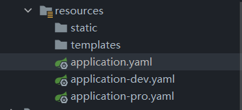
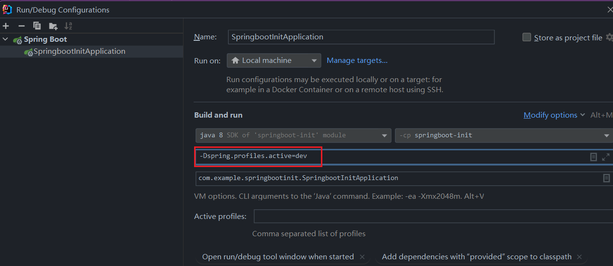

# springboot 学习记录

> 注意：Springboot注解`@SpringBootApplication`默认扫描当前类的同包或子包下的类。因此位置一定要放对！！否则访问地址会报404错误！！

## 起步依赖

1. idea搭建springboot项目依赖的是 [start.spring.io](https://start.spring.io) 需要网络
2. springboot帮我们配置好了所需依赖的版本，这样我们不用担心版本冲突的问题
3. **JDK8**对应的major version是**52**，**JDK17**对应的major version是**61**
4. `@RestController`相当于是`@Controller`和`@ResponseBody`的组合,也就是说, `@RestController`标记的类其方法返回值不会被当作视图来解析。而传统的`@Controller`注解，其返回值会被当作视图经过视图解析器来解析。

## 配置文件

springboot是**基于约定**的框架。想要替换其默认配置，通过`application.properties`或者`application.yaml`来进行配置

- properties:

```properties
server.port=8080
```

- yaml/yml: ( 冒号`:`和值`8080`之间**有空格** )
  
```yaml
server:
  port: 8080  #有空格
```

### springboot配置文件优先级

> springboot加载配置文件**有优先级**： 如果properties，yml，yaml三个配置文件在根目录中同时存在，那么*对于重复的配置部分*，**springboot会优先加载properties中的配置，其次是yml，最后是yaml。**

## yaml

yaml全程是 yaml ain't markup language。

yaml**以数据为中心**，能更直观的被人类理解，比传统xml方式更简洁。

### yaml语法

1. 大小写敏感
2. 数据值前必须有空格
3. 使用缩进表示层级关系
4. `#`表示注释
5. 缩进的空格数目不重要，只要相同层级的元素左侧对齐即可

### yaml数据格式

- 对象（map）
```yaml
person:
  name: zhangsan

person: {name: zhangsan}
```

- 数组
```yaml
address:
  - beijing
  - shanghai

address: [beijing,shanghai]
```

- 纯量
```yaml
msg1: "hello \n world"  #会识别转义字符，\n将被解析为空格
msg2: 'hello \n world'  #不会识别转义字符，\n将原样输出
```

### yaml参数引用

```yaml
name: lisi

person: 
  name: ${name}  #引用上值
```

## 读取配置内容

1. @Value
```java
@Value("${name}")
private String name;
```
2. Environment
```java
@Resource   //基于名称注入  @Autowired 基于类型注入
private Environment env;

System.out.println(env.getProperty("person.name"));
System.out.println(env.getProperty("address[0]"));
```
3. @ConfigurationProperties

创建一个类来接收配置文件中的属性

使用`@ConfigurationProperties`注解来接收配置文件中的属性

使用prefix属性来指定属性前缀，防止错误的注入

```java
@Component
@ConfigurationProperties(prefix = "person")
public class Person {
    private String name;
    private int age;

    public String getName() {
        return name;
    }

    public void setName(String name) {
        this.name = name;
    }

    public int getAge() {
        return age;
    }

    public void setAge(int age) {
        this.age = age;
    }

    @Override
    public String toString() {
        return "Person{" +
                "name='" + name + '\'' +
                ", age=" + age +
                '}';
    }
}
```
```yaml
server:
  port: 8080

name: abc

person:
  name: zhangsan
  age: 20

person2: {name: zhangsan, age: 20}

address: [beijing, shanghai]

msg: "hello \n word!"
msg2: 'hello \n word!'

```

## profiles

profiles属性可以指定当前配置文件生效的环境，在实际开发中通常一个springboot应用会在多个场景下使用，比如开发场景，生产场景，测试场景等。这些场景的配置文件不尽相同。如果每次都手动来更改配置文件，过于繁琐。因此，springboot 的 profiles 属性可以帮我们快速切换配置文件。

### 1. 多profile文件方式

假设现在有两个配置文件，`application-dev.yaml`和`application-pro.yaml`，分别对应开发环境和生产环境。想要快速切换这两个配置文件，只需要在主配置文件`application.yaml`中声明 profiles 属性即可



```yaml
spring:
  profiles:
    active: pro
```
### 2. yml多文档方式

多个配置文件方式写起来比较麻烦，我们可以通过一个application.yml文件来进行配置。只需要使用 `---` 来对不同环境下的配置进行分割即可。

```yaml

spring:
  profiles:
    active: test   # 设置激活的配置
---
server:
  port: 8080
spring:
  profiles: dev
---
server:
  port: 8081
spring:
  profiles: test
---
server:
  port: 8082
spring:
  profiles: pro
---

```

### 3. 外部参数方式

#### 1. 通过虚拟机选项 vm-options 来进行配置

这种方式会覆盖掉application.yaml中的配置



#### 2. 通过命令行参数进行配置

在运行项目的jar包时加上`--spring.profiles.active=dev`，可以指定当前激活的配置文件。

## 内部配置加载顺序
    
springboot启动时会从以下位置加载配置文件：

1. `file: ../config/` 当前项目下的/config目录
2. `file: ../` 当前项目的根目录
3. `classpath:/config/` classpath的/config目录
4. `classpath:/` classpath根目录

以上四个位置的配置文件都会被读取，高优先级的文件配置会覆盖低优先级的文件配置

