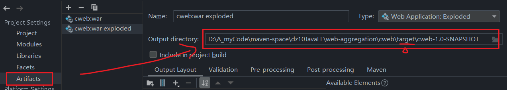
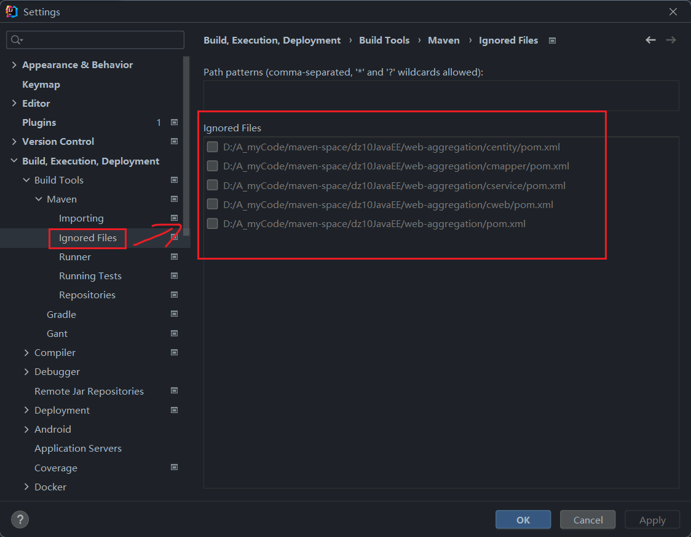
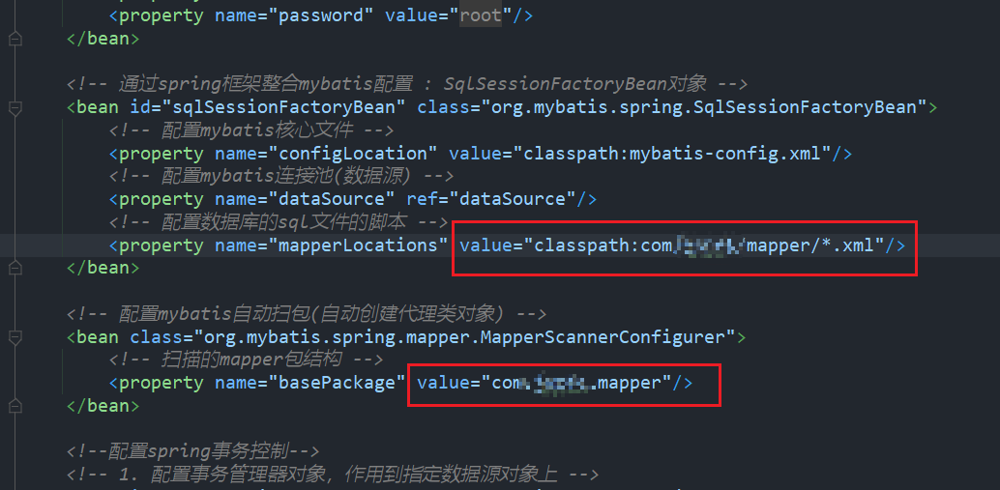

# 使用maven插件来运行web项目

1. 导入插件

```xml
<build>
    <plugins>
        <plugin>
            <groupId>org.apache.tomcat.maven</groupId>
            <artifactId>tomcat7-maven-plugin</artifactId>
            <version>2.2</version>
            <configuration>
                <port>8080</port>
                <path>/</path>
            </configuration>
        </plugin>
    </plugins>
</build>
```
2. 设置模块/项目打包方式为war `<packaging>war</packaging>`

3.将项目的工件输出目录改到target下 (如果不是target的话)



# maven聚合方式整合SSM

将 pojo层，mapper层，service层，controller层每一层分出一个模块来，独立运行测试。

1. 创建父模块，一个普通的java项目。 配置pom.xml的`<packaging>`标签值为pom : pom项目通常是用于管理多模块项目的顶级父项目。

2. 创建子模块： pojo, mapper, service, web

对于需要依赖其他模块的模块的pom里配置依赖。

3. 如果模块的pom.xml文件变灰，并出现一个横线被划掉，是因为pom被maven忽略了。这样设置 (取消勾选即可)



## 遇到的问题

### 1. org.apache.ibatis.binding.BindingException

这个异常一般是mapper.xml没有和mapper.java建立映射关系导致的。

首先检查mapper.xml的namespace命名空间是否有误。

然后检查applicationContext.xml有没有配置mapper的映射, 以及映射路径是否正确

```xml
<!-- 通过spring框架整合mybatis配置 : SqlSessionFactoryBean对象 -->
<bean id="sqlSessionFactoryBean" class="org.mybatis.spring.SqlSessionFactoryBean">
    <!-- 配置mybatis核心文件 -->
    <property name="configLocation" value="classpath:mybatis-config.xml"/>
    <!-- 配置mybatis连接池(数据源) -->
    <property name="dataSource" ref="dataSource"/>
    <!-- 配置数据库的sql文件的脚本 -->
    <property name="mapperLocations" value="classpath:com/XXXX/mapper/*.xml"/>
</bean>
```

最后检查编译后的目录中有无mapper.xml，如果没有，那就是问题所在：编译的时候没有mapper.xml与mapper.java映射

解决方案：  在pom中配置

将`<deirectory>`路径下， `<include>`包含的文件作为项目的资源文件。用于确保maven在最终构建项目是将这些文件放到编译后目录中，以便项目在部署时能访问这些资源。

```xml
<!-- 项目打包时会将java目录中的*.xml文件也进行打包 -->
<build>
    <resources>
        <resource>
            <directory>src/main/java</directory>
            <includes>
                <include>**/*.xml</include>
            </includes>
            <filtering>false</filtering>
        </resource>
    </resources>
</build>
```

### 2. nested exception is org.springframework.beans.factory.NoSuchBeanDefinitionException

这个异常就是IoC容器找不到bean导致的。

首先检查注解问题，看看是不是标记了`@Autowire`的字段没有加注解导致spring找不到这个bean

然后检查配置文件，是否配置了自动扫包  `<context:component-scan base-package="com.XXXX"/>`

**仔细**检查`applicationContext.xml`配置文件, 看看mybatis扫包配置路径是否错误，sqlSessionFactoryBean里的maapper映射文件路径配置是否正确

这个问题我排查了好久最后发现是这两个地方路径配置有误：

