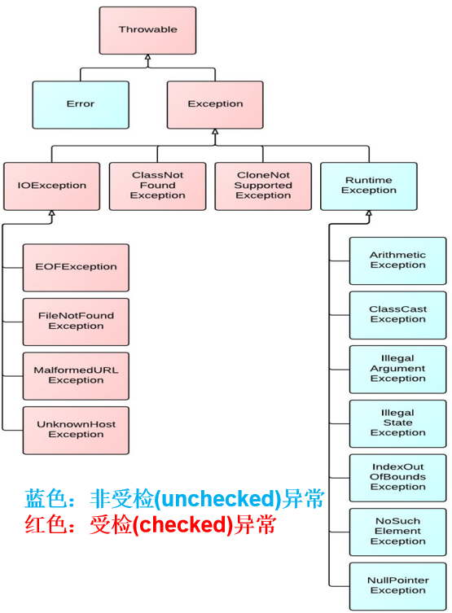

# 模拟测试摸底题

### 1. (开胃题) 请结合下张图片写出异常的分类(大体即可, 无需细分)


```
1.受查异常
    输入输出异常IOException
    类找不到异常ClassNotFoundException
    ...

2.运行时异常
    算数异常ArithmeticException
    类型转换异常ClassCastException
    数组下标越界异常IndexOutOfBoundsException
    空指针异常NullPointerException
    ...

```

### 2. 请解释下try-catch-finally的执行顺序和执行时机
```
先执行try中的语句，当出现异常时，匹配对应的catch块，执行异常处理语句。之后执行finally语句，程序退出。
无论是否出现异常，finally中的语句都会执行。
finally的优先级甚至强于return。
只有System.exit()可以强制不执行finally中的语句
```

### 3. 请使用Random和StringBuilder来生成一个5位的随机验证码, 要求第一位必须是数字, 后4位均为随机大小写字母

```java
import java.util.Random;

/**
 * A-Z : 65-90
 * a-z : 97-122
 */
public class RandomCode {
    public static void main(String[] args) {
        StringBuilder sb = new StringBuilder();
        Random random = new Random();
        //生成第一位数字
        int v1 = random.nextInt(10);
        sb.append(v1);
//        System.out.println(sb);
        //生成后四位随机字母
        for (int i = 0; i < 4; i++) {
            char v2 ;
            //随机生成大写或小写字母
            if (random.nextInt(2)==1){
                //大写字母
                v2= (char) (random.nextInt(65,91));
            }else {
                //小写字母
                v2 = (char) (random.nextInt(97,123) );
            }
            sb.append(v2);
        }
        System.out.println(sb);
    }
}

```
### 4. 请使用时间工具类, Random和StringBuilder生成一个学生对象的唯一识别id(String类型), id格式为: 符号位(0正1负)-时间毫秒值-对象哈希值-随机数(四位), 例如1-153643763-000112-1234, 测试类要求生成3名学生并打印他们的id

```java
import java.util.Objects;
import java.util.Random;

class Test{
    public static void main(String[] args) {
        Student stu1 = new Student();
        Student stu2 = new Student();
        Student stu3 = new Student();
        System.out.println(stu1.getId());
        System.out.println(stu2.getId());
        System.out.println(stu3.getId());
    }
}
class Student {
    public String id;
    public String name;
    public String age;

    public Student() {
        this.id = method();
    }

    /**
     * 这里写上你生成id的方法
     */
    public String method() {
        String id = null;
        StringBuilder sb1 = new StringBuilder();
        String split = "-";
        int id1 = new Random().nextInt(0, 2);// 第一位0/1
        long id2 = System.currentTimeMillis();   //第二位 毫秒值
        int id3 = hashCode();    //第三位 哈希值
        //生成四位随机数字
        int a = new Random().nextInt(0,10);
        int b = new Random().nextInt(0,10);
        int c = new Random().nextInt(0,10);
        int d = new Random().nextInt(0,10);
        sb1.append(a);
        sb1.append(b);
        sb1.append(c);
        sb1.append(d);
        String id4 = String.valueOf(sb1);   //id最后一位 是四位随机数
        StringBuilder sb2 = new StringBuilder();
        //组装，拼接
        sb2.append(id1);
        sb2.append(split);
        sb2.append(id2);
        sb2.append(split);
        sb2.append(id3);
        sb2.append(split);
        sb2.append(id4);
        id = String.valueOf(sb2);
        return id;
    }

    public String getId() {
        return id;
    }

    @Override
    public boolean equals(Object o) {
        if (this == o) return true;
        if (o == null || getClass() != o.getClass()) return false;
        Student student = (Student) o;
        return Objects.equals(id, student.id) && Objects.equals(name, student.name) && Objects.equals(age, student.age);
    }

    @Override
    public int hashCode() {
        return Objects.hash(id, name, age);
    }
}


```

### 5. String、StringBuffer、StringBuilder三者的异同
```
String用于存储字符串。提供了少量的操纵字符串的方法，但是不够用。
String是不可变字符串，StringBuffer和StringBuilder是可变字符串
StringBuilder：
JDK8之前通过`char[]`存储单个元素
JDK8之后通过`byte[]`存储单个元素
`StringBuilder` 通过无参构造设置初始空间大小是16byte
StringBuffer和StringBuilder是用于操纵字符串。提供了大量的字符串操纵的方法。如字符串的增删改查功能。
StringBuffer和StringBuilder的区别在于：
    StringBuffer是java早期的一个字符串操纵类。线程安全，但是效率低。
    StringBuilder是jdk1.5之后新增的字符串操纵类，线程不安全，但是效率高。
日常开发中优先选择使用StringBuilder。
```

### 6. 请尝试运行下面代码, 并解释一下问题:
```java
public class Test {
    public static void main(String[] args) {
        Integer i1 = 100;
        Integer i2 = 100;

        Integer j1 = 1000;
        Integer j2 = 1000;

        System.out.println(i1 == i2);
        System.out.println(j1 == j2);
    }
}

```
#### (1). Integer的自动装箱和自动拆箱是如何实现的
```
自动装箱：Integer i = 1000;
反编译后的代码：
Integer a = Integer.valueOf(int i);
自动拆箱: int j = i;
反编译后的代码：
int j = Integer.intValue(Integer i)

```

#### (2). 请解释代码的运行结果
```
程序允许结果： true false
第一个true很好解释，因为两个包装类型的值是一样的，所以二者==比较是true。但是第二个和第一个看起来似乎没什么区别，按理说也应该是true。但是为什么会是false呢？
这其实是Integer的自动装箱底层原理在作怪。
Integer的自动装箱是通过valueOf(int i)方法实现的。这个方法源码如下： 
    public static Integer valueOf(int i) {
        if (i >= IntegerCache.low && i <= IntegerCache.high)
            return IntegerCache.cache[i + (-IntegerCache.low)];
        return new Integer(i);
    }
这个代码就算看不懂也大概知道什么意思。当传入的整型变量大小在IntegerCache.low和IntegerCache.high之间时，返回IntegerCache缓存中的一个值。否则返回一个new出来的Integer。
这个IntegerCache.low的值其实是-128，而IntegerCache.high的值其实是127.这两个数值是在IntegerCache静态类中定义的。
知道了这两个值的具体数值后，就更容易理解这个问题了。当传入的整型变量在-128~127之间时，是可以通过某种方法（IntegerCache.cache）获取到这个整型值的Integer类型变量的。当整型值大小超过127或者小于了-128，那么这个自动装箱方法就会返回一个new出来的新的Integer。
这样的话由于new了新的对象，在堆内存中开辟了新的空间，他们的地址值就必然会不一样。这时用==比较就会得到false的结果。

```

### 7. 请解析下面这个http访问请求, 并把访问的数据封装成一个用户对象`https://www.so.com/s?name=张三&pwd=123456&email=2366455@qq.com&sex=1&date=2023-08-11`, 解析完成后把对象打印出来
```java
class User {
    private String name;
    private String pwd;
    private String email;
    private int sex;
    private LocalDate date;

    public User() {
    }

    public void setName(String name) {
        this.name = name;
    }

    public void setPwd(String pwd) {
        this.pwd = pwd;
    }

    public void setEmail(String email) {
        this.email = email;
    }

    public void setSex(int sex) {
        this.sex = sex;
    }

    public void setDate(LocalDate date) {
        this.date = date;
    }

    @Override
    public String toString() {
        return "User{" +
                "name='" + name + '\'' +
                ", pwd='" + pwd + '\'' +
                ", email='" + email + '\'' +
                ", sex=" + sex +
                ", date=" + date +
                '}';
    }
}
```
```java
class tt{
    public static void main(String[] args) {
        User student = new User();
        String url = "https://www.so.com/s?name=张三&pwd=123456&email=2366455@qq.com&sex=1&date=2023-08-11";
        StringBuilder sb = new StringBuilder();
        sb.append(url);
        int nIndex = sb.indexOf("name");
        int pIndex = sb.indexOf("pwd");
        int eIndex = sb.indexOf("email");
        int sIndex = sb.indexOf("sex");
        int dIndex = sb.indexOf("date");
        String name1 = sb.substring(nIndex, pIndex-1); //name=张三
        String pwd1 = sb.substring(pIndex,eIndex-1); //pwd=123456
//        System.out.println(name1);
//        System.out.println(pwd1);
        String email1 = sb.substring(eIndex,sIndex-1);  //email=2366455
        String sex1 = sb.substring(sIndex,dIndex-1);  //sex=1
        String date1 = sb.substring(dIndex); // date=2023-08-11
//        System.out.println(date1);
        student.setName(name1.split("=")[1]);
        student.setPwd(pwd1.split("=")[1]);
        student.setEmail(email1.split("=")[1]);
        student.setSex(Integer.parseInt(sex1.split("=")[1]));
        student.setDate(LocalDate.parse(date1.split("=")[1]));
        System.out.println(student);
    }
}
```