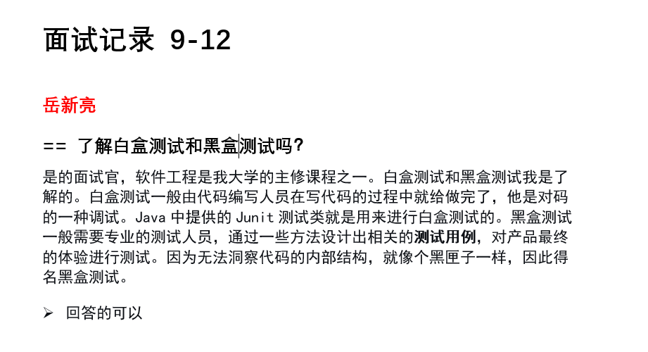

# MYHD组模拟技术面试记录规范文档

###### 版本 v1.0.0 / 最后修改于 2023-9-12 
###### 发布地址: [click me](https://github.com/HmEJ/myGitHub/blob/main/Study_Notes/%E9%9D%A2%E8%AF%95%E8%AE%B0%E5%BD%95%E8%A7%84%E8%8C%83%E6%96%87%E6%A1%A3.md)

此面试记录规范文档旨在确保我们的模拟技术面试过程能够有效地进行并记录，以便于后续评估和反馈。通过遵守这一规范，我们可以保证面试的一致性，提供有价值的反馈，并为小组成员提供清晰的方向，帮助在技术面试中不断进步。另外，依据约束力强弱，本规范依
分为【强制】、【推荐】两大类。在延伸信息中，“说明”对规约做了适当扩展和解释；
“正例”提倡什么样的编码和实现方式；“反例”说明需要提防的雷区，以及真实的错误案例。

## 面试目的

模拟技术面试是为了帮助小组成员熟悉真实技术面试的流程，提高技术面试技能。同时，它也有助于面试官识别面试者的优势和改进点，以便为招聘决策提供更多信息和可靠的数据。

## 面试流程

开始面试 - 面试官提问 - 回答者作答 - 记录员同时记录 - 面试结束 - 记录员整理文档

## 规范文档用途

本规范文档的主要用途包括：

- 记录面试过程中的问题和回答，以便后续分析和评估。
- 提供面试者详细的反馈，帮助他们改进技能。
- 为后续面试流程提供参考，确保一致性和公平性。
- 存档面试记录，以备将来查看或审计。

## 使用本规范文档

请面试官和面试者按照本规范文档的要求进行模拟技术面试。在面试过程中，记录员要记录问题和回答的具体内容，提供评价分数或意见，并在面试结束后完成总结与反馈部分。面试记录应该保持机密，只有授权人员可以访问。

## 定制规范

为确保能**快速、准确**记录面试管的问题和面试成员的答案，要求记录员具备一定的**速敲能力**以及**语言组织能力**，即 ***每分钟输入有效字符数不小于60字*** 且 ***大脑识别语音转文字输出效率不低于80%*** 。为方便，请使用**Word**进行记录，小组成员可根据此**Word**文档整理出自己的面试笔记。

符合以上标准的面试记录人员，记录请遵循以下规范：

1. 【强制】记录面试官的有效提问。

例如，面试官说了这样一段话： “ 我看你主修课程里有软件工程，那你了解软件工程中的白盒测试和黑盒测试吗？ ” 。对于这句话记录员应当精简为 **“了解黑盒测试和白盒测试吗？”**
>【反例】我看你主修课程里有软件工程，那你了解软件工程中的白盒测试和黑盒测试吗？

2. 【强制】对于面试官的题问，前面用 `==` 标识。例如：

    `==了解事务的底层原理吗？`
>【反例】 -了解事务底层原理吗？ 
>【反例】 & 事务？

3. 【强制】请记录面试管对回答的评价，如果面试官没有评价，请记录人员给一个评价。评价请用 `>` 标识。请注意，`>` 与记录文字之间应当存在一个空格(占位符)。此举旨在帮助面试成员更好的复盘，让其了解到自己的问题所在。

>【正例】> 回答的很全面，但是有两点不足： ...  
>【反例】（无评价）

3. 【推荐】面试记录应当记录当天日期，字符使用`黑体`，字号选择`一号`，或者`标题`，该步骤应当尽量在面试开始前完成。

4. 【推荐】面试记录应当写明面试者的姓名，姓名使用`黑体`，字号选择`三号`并加粗，颜色改为**红色**。这是准备工作，你应当一开始就完成。

5. 【推荐】对于面试官的提问，推荐将**字体加粗，加大**，以便于更好的定位和查找。该工作可以放到面试结束后整理阶段做，在速记阶段，你只需要遵循 `规范[2]` 即可。

以上规范是目前待定规范，请记录人员积极遵守。如果之后有变动，可能会进行更新发布。

以下展示一个规范的问题记录：

