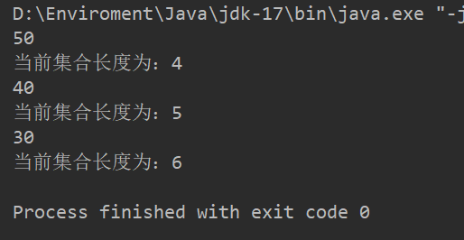
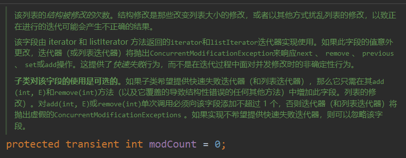
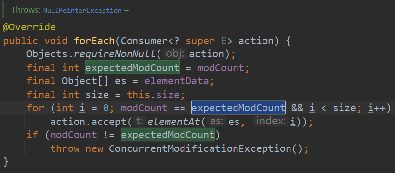
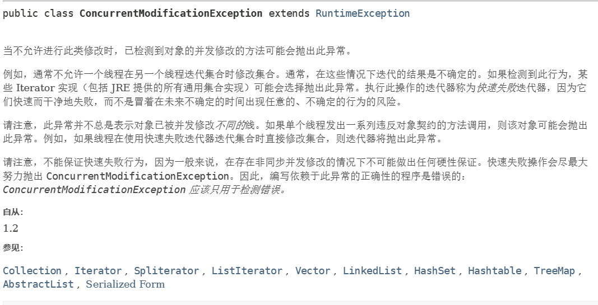
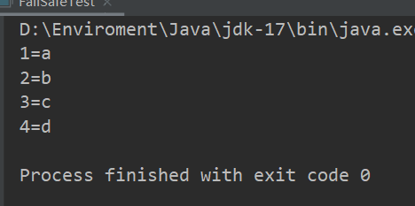

## 什么是快速失败(fail-fast)？
在用迭代器遍历集合时,当集合的结构被修改,会抛出`ConcurrentModificationException`并发修改异常。

java.util包下的集合类都是快速失败的, 常见的的使用fail-fast方式遍历的容器有`HashMap`和`ArrayList`等。

### fail-fast(快速失败)
- 快速失败发生的情况：
1. 单线程环境下
集合在遍历过程中，对集合进行增删操作，没有调用迭代器的方法，而是直接调用集合自身的方法，就会产生快速失败
```java
ArrayList<Integer> list = new ArrayList<>();
list.add(50);
list.add(40);
list.add(30);
Iterator<Integer> iterator = list.iterator();
while (iterator.hasNext()){
    System.out.println(iterator.next());
    list.add(60);// 使用集合自身的add方法添加元素，会产生异常
    System.out.println("当前集合长度为："+list.size());
}
```
运行结果：


考虑使用如下代码：
```java
ArrayList<Integer> list = new ArrayList<>();
list.add(50);
list.add(40);
list.add(30);
ListIterator<Integer> iterator = list.listIterator();
while (iterator.hasNext()){
    System.out.println(iterator.next());
    iterator.add(60); //使用迭代器的添加方法添加元素，不会出现异常
    System.out.println("当前集合长度为："+list.size());
}
```
运行结果：




上述代码同时演示了集合的两个迭代器的用法，iterator和listiterator的联系与区别如下：
#### 相同点：
二者作用都是遍历集合。当不需要在遍历时对集合内容进行干涉时，二者是等效的。
#### 不同点：
1. 适用范围不同。 iterator适用于所有的集合，而listiterator只适用于list集合
2. iterator有remove方法。listiterator特有add,set方法，用于添加，修改集合元素。
3. listiterator和iterator都有hasNext()和next()方法，可以实现向后遍历。但是listiterator特有hasPrevious()和previous()方法，可以实现向前遍历。
4. listiterator可以定位当前索引位置。通过nextIndex()方法或者previousIndex()方法可以确定后一个或前一个元素的索引。

#### 为何在迭代器遍历时修改集合内容会导致异常？
1. 在迭代器遍历集合的过程中，会有一个modCount变量来记录集合中的内容是否发生变化。如果集合内容发生了变化，就会修改modCount的值。


👆modCount在AbstractList中被定义为受保护的transient整型值。这意味着该值不可被序列化。
2. 迭代器在进行next()/hasNext()进行遍历之前，都会检查modCount值是否与expectedModCount相等。如果不相等就会抛出异常。


👆ArrayList中forEach方法-当`modCount!=expectedModCount`时抛出异常

ConcurrentModificationException并发修改异常的官方解释：



## 安全失败(fail-safe)
采用安全失败机制的集合，在遍历集合时会将原集合复制一份。并在复制后的集合中进行遍历操作。因此修改集合内容并不会触发并发修改异常。

java.util.concurrent包下面的所有的类都是安全失败的,如ConcurrentHashMap, CopyOnWriteArrayList等

安全失败示例代码：
```java
ConcurrentHashMap<Integer, String> map = new ConcurrentHashMap<>();
map.put(1, "a");
map.put(2, "b");
map.put(3, "c");
Set<Map.Entry<Integer, String>> entries = map.entrySet();
Iterator<Map.Entry<Integer, String>> iterator = entries.iterator();
while (iterator.hasNext()){
    System.out.println(iterator.next());
    map.put(4, "d");
}
```
运行结果：



#### 在遍历并发哈希映射时不发生并发修改异常，为什么？
因为并发哈希映射采用安全失败的机制，其迭代器遍历的是原映射的快照(备份),因此迭代器并不会校验modCount是否被修改。因此不会产生并发修改异常。

## 总结
fail-safe（安全失败）允许在遍历的过程中对容器中的数据进行修改，而fail-fast（快速失败）则不允许。